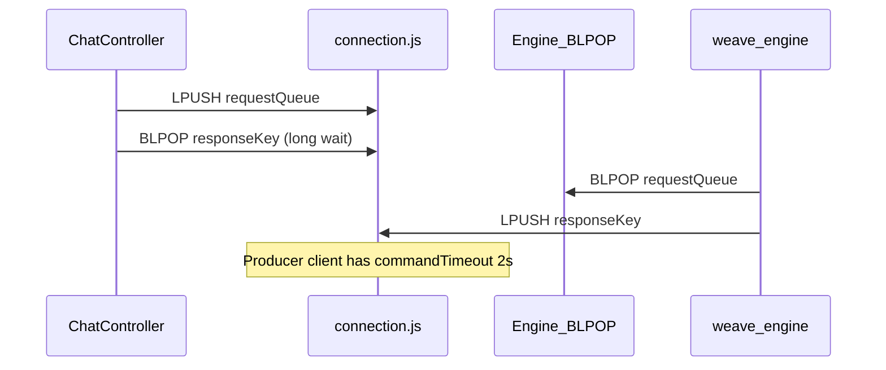

# Fix `CHAT_PROCESSING_FAILED` / `Connection is closed` on weave-ai chat

## What is failing

Flow: Next.js [`sendChatMessage`](weave-app/app/_services/ai-agent-service/agent-service.ts) → API [`ChatController.postChat`](weave-api/src/modules/weave-ai/controllers/chat.controller.js) → [`_requestEngineChat`](weave-api/src/modules/weave-ai/controllers/chat.controller.js) (`LPUSH` job + `BLPOP` on a per-request response key) → engine [`chat.processor.js`](weave-engine/src/modules/weave-ai/chat.processor.js) consumes the request queue and `LPUSH`es the response.

The log shape (`code: CHAT_PROCESSING_FAILED`, message `Connection is closed`) comes from `_normalizeApiError` in the outer `catch`: that path is used when the thrown error does **not** carry a string `code` (unlike engine `success: false` errors, which become `Error` objects with `code` set in `_requestEngineChat`). That points to an **infrastructure/client** failure during the try block—most plausibly **Redis `BLPOP` on the API process**, not the LLM response body.

## Root cause (code-level)

[`_requestEngineChat`](weave-api/src/modules/weave-ai/controllers/chat.controller.js) imports Redis from [`weave-api/src/services/queue/connection.js`](weave-api/src/services/queue/connection.js), which configures:

- `commandTimeout: 2000`
- `maxRetriesPerRequest: 1`
- aggressive reconnect (`retryStrategy` stops after one retry)

Blocking `BLPOP` can legitimately wait up to `WEAVE_ENGINE_CHAT_TIMEOUT_SECONDS` (default **45** in the same controller). The project already states the fix pattern in [`weave-api/src/services/queue/consumer-connection.js`](weave-api/src/services/queue/consumer-connection.js): **do not set `commandTimeout` for `BLPOP`**, and use `maxRetriesPerRequest: null` for long-lived / blocking behavior.

Using the producer client for `BLPOP` is inconsistent with that pattern and can produce socket-level failures (often surfaced as generic English messages without a stable `error.code`).

## Recommended implementation

1. **Add a small dedicated Redis client for engine chat RPC** (preferred over reusing the singleton `consumer-connection` instance, to avoid coupling chat traffic to the reasoning consumers’ connection lifecycle):
   - New file e.g. [`weave-api/src/services/queue/engine-rpc-connection.js`](weave-api/src/services/queue/engine-rpc-connection.js) exporting `new Redis(process.env.REDIS_URL, { ... })` with the **same safe defaults as** [`consumer-connection.js`](weave-api/src/services/queue/consumer-connection.js): `maxRetriesPerRequest: null`, **no** `commandTimeout`, `enableOfflineQueue: true`, `enableReadyCheck: true`, sensible `connectTimeout` and `retryStrategy`.
   - Optional DRY refactor: extract a shared `BLOCKING_REDIS_OPTIONS` constant imported by both `consumer-connection.js` and `engine-rpc-connection.js` so options cannot drift.

2. **Switch `_requestEngineChat` only** in [`chat.controller.js`](weave-api/src/modules/weave-ai/controllers/chat.controller.js) to use `engine-rpc-connection` for `LPUSH` + `BLPOP` + `DEL` on the response key. Keep [`connection.js`](weave-api/src/services/queue/connection.js) for fast producer paths ([`queue-controller.js`](weave-api/src/services/queue/queue-controller.js))) unchanged.

3. **Improve diagnostics (minimal)** in the `[weave-ai/chat] request failed` log: include `error?.name`, `error?.code`, and `cause` if present. That way if anything remains (DB pool, upstream LLM), the next log line identifies the layer without guessing.

4. **Verify at runtime** (manual): send a chat message with `docker compose` stack; confirm no 500 and that slow engine responses still complete within `WEAVE_ENGINE_CHAT_TIMEOUT_SECONDS`.

## Out of scope (optional follow-ups)

- **Separate issue:** [`trigger-consumer.js`](weave-api/src/services/reasoning/trigger-consumer.js) and [`response-consumer.js`](weave-api/src/services/reasoning/response-consumer.js) both call `blpop(..., 0)` on the **same** `consumer-connection` instance; only one can run at a time on a single TCP connection. Worth fixing later with `duplicate()` per consumer loop, but it is not required to resolve the chat-specific misconfiguration above.
- If errors persist **after** the Redis client fix, add **targeted retries** in the engine LLM layer for transient network closes (`ECONNRESET`, messages containing `Connection is closed`)—second line of defense.
