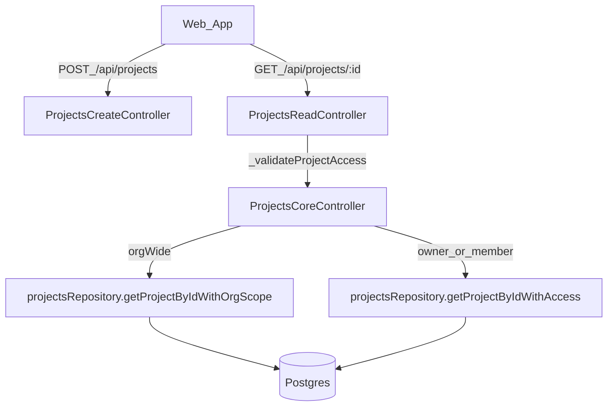

## What we know from logs
- Frontend successfully navigates to `/projects/<uuid>/` (Next route), but subsequent API calls fail with JSON 404 `{"error":"Projeto não encontrado ou você não tem acesso"}` for:
  - `GET /api/projects/:id/stages`
  - `GET /api/projects/:id` (project hydration)
  - `GET /api/projects/:projectId/collaborators`
  - `GET /api/projects/:projectId/notes`
- You confirmed:
  - DB baseline is `weave-api/db_structure_docs/new_structure_db.sql` (uppercase enums, `workspace_id`, etc.)
  - The created project **appears in the projects list**, so it is being persisted.

## Likely failure modes (ranked)
- **Membership/org-scope mismatch**: `ProjectsCoreController._validateProjectAccess` has an org-wide path that calls `projectsRepository.getProjectByIdWithOrgScope(projectId, membership.id)`.
  - If `membership.id` is not actually the workspace id (common shape is `workspace_id`), org-scope lookups will always fail.
  - This would also affect `ProjectsReadController.getCollaborators`’ org-scope path.
- **`_canAccessAllOrganizationProjects` returning true unexpectedly**: If normal members are being treated as org-wide, access validation will always take the org-scope path and fail.
- **Repository org-scope query doesn’t match new schema**: `getProjectByIdWithOrgScope` may filter on the wrong column (e.g., `workspace_id` vs `workspace_id`) even though other queries match new schema.
- **ID type mismatch in specific queries**: Less likely (would typically throw 500), but we will verify casts and column types against `new_structure_db.sql`.

## Investigation steps (read-only + runtime verification)
- Inspect workspace membership shape and role policy:
  - [`weave-api/src/modules/workspaces/repositories/workspaces.repository.js`](weave-api/src/modules/workspaces/repositories/workspaces.repository.js) `getActiveOrganizationWithMembership` return shape.
  - [`weave-api/src/modules/workspaces/workspace-role-policy.js`](weave-api/src/modules/workspaces/workspace-role-policy.js) for `ACCESS_ALL_WORKSPACE_PROJECTS` logic.
- Inspect org-scope project queries:
  - [`weave-api/src/modules/projects/repositories/projects-read.repository.js`](weave-api/src/modules/projects/repositories/projects-read.repository.js) `getProjectByIdWithOrgScope`, `getCollaboratorsWithOrgScope`, `getAssociatedNotesWithOrgScope`.
- Add a minimal, deterministic reproduction using curl (once we’re executing):
  - `POST /api/projects` capture returned `id`.
  - `GET /api/projects/:id` with same auth.
  - Confirm whether the failure path is org-scope or access-scope by temporarily logging branch selection (or returning debug fields) in `ProjectsCoreController._validateProjectAccess`.

## Fix approach (minimal + schema-aligned)
- **Normalize membership workspace id**:
  - Update `ProjectsCoreController._validateProjectAccess` and `ProjectsReadController.getCollaborators` to pass `membership.workspace_id` (or equivalent) into org-scope repository methods.
  - Keep compatibility by supporting both shapes: `membership.workspace_id ?? membership.workspace_id ?? membership.id` only if `membership.id` is confirmed to be org id.
- **Harden `_canAccessAllOrganizationProjects` usage**:
  - Ensure it only returns true for roles that actually have `WORKSPACE_PERMISSIONS.ACCESS_ALL_WORKSPACE_PROJECTS`.
- **Align org-scope repository filters to new schema**:
  - Ensure `getProjectByIdWithOrgScope` filters on `projects.workspace_id` (not legacy `workspace_id`).
- **Optional safety improvement**:
  - Change `_handleError` mapping so authorization failures return 403 (not 404), but only if you prefer more explicit API semantics.

## Validation
- Wizard flow:
  - Create project (Basic step) → Stages step loads successfully.
  - Project page hydration (`getProjectById`, `getProjectStages`, `getCollaborators`, `getProjectNotes`) succeeds.
- Regression checks:
  - Owner access works.
  - Collaborator access works.
  - Org-wide access (admin) works across org projects.

