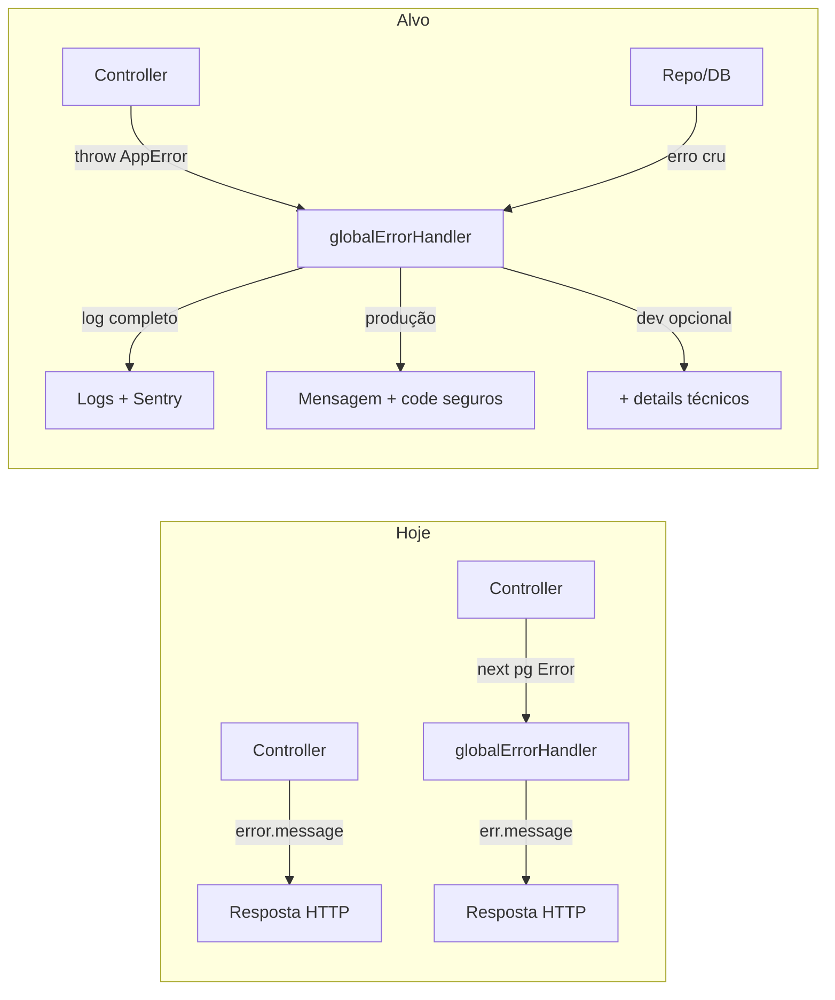

# Padronização segura de erros no weave-api

## Diagnóstico atual

O handler global em [`weave-api/src/middlewares/errors/error-handler.js`](weave-api/src/middlewares/errors/error-handler.js) **sempre** devolve `err.message` ao cliente:

```13:21:weave-api/src/middlewares/errors/error-handler.js
    res.status(err.statusCode || 500).json({
      error: {
        message: err.message || "Internal Server Error",
        status: err.statusCode || 500,
        timestamp: new Date().toISOString(),
        path: req.originalUrl,
        method: req.method,
      },
    });
```

Hoje coexistem **3 padrões** que se contradizem:

| Padrão | Exemplo | Risco |
|--------|---------|-------|
| `next(error)` sem mapear | tags, api-tokens, notifications | Mensagem crua do Postgres no JSON |
| `catch` com `error.message` | [`password.controller.js`](weave-api/src/modules/password/password.controller.js), [`organizations.controller.js`](weave-api/src/modules/organizations/controllers/organizations.controller.js) | 400/500 com texto interno |
| `_handleError` por string | [`users/base.controller.js`](weave-api/src/modules/users/controllers/base.controller.js) (bom no 500), [`notes/base.controller.js`](weave-api/src/modules/notes/controllers/base.controller.js) (cai em `next(error)`) | Inconsistente |

O front já tem redação parcial em [`weave-app/app/_services/api-error.ts`](weave-app/app/_services/api-error.ts) (`getSafeApiErrorMessage`, `buildApiError`), mas **não substitui** a necessidade de o backend não enviar lixo — qualquer cliente (mobile, integrações) receberia o vazamento.

**Bom precedente a replicar:** mapeamento PG `23505` em [`unique-conflicts.js`](weave-api/src/modules/users/utils/unique-conflicts.js) e payload estruturado em [`plan-limit-http.js`](weave-api/src/utils/plan-limit-http.js).



---

## Princípios (contrato)

1. **Erro operacional** (`isOperational: true`): validação, auth, permissão, recurso não encontrado, conflito, limite de plano — pode ir ao cliente com `code` estável + `message` curta e curada.
2. **Erro interno** (PG, rede, bug, multer interno, rota quebrada): **nunca** expor `error.message` original em **produção**; logar stack + contexto (userId, orgId, route, requestId).
3. **Em desenvolvimento** (sua escolha): respostas podem incluir campo opcional `details` (mensagem técnica, `pgCode`, constraint) — **somente** quando `NODE_ENV !== 'production'`.
4. **Escopo desta fase:** apenas **weave-api** (HTTP). Worker/engine ficam fora.
5. **Idioma:** todo conteúdo voltado ao cliente e à camada de erros deve ser **em inglês** — ver seção abaixo.

### Idioma (English only)

Tudo relacionado à API de erros fica em **inglês**:

| Área | Regra |
|------|--------|
| `error.message` (resposta HTTP) | Inglês curto e estável; nunca português em endpoints novos ou migrados |
| `AppError` / factories / defaults genéricos | Inglês (ex.: `"Note not found"`, `"Invalid request"`) |
| `code` | Já é inglês (`SCREAMING_SNAKE_CASE`) — manter |
| JSDoc e docs (`error-handler.md`, `codes.js`) | Inglês |
| Logs do servidor | Inglês preferencial para mensagens estruturadas; detalhes técnicos do PG/stack podem permanecer como vierem do driver |

**Migração:** módulos hoje em PT (ex.: notes `"Nota não encontrada"`, organizations `"Erro ao criar área"`, weave-ai multer) são convertidos **na mesma PR** em que passam a usar `AppError` — não deixar PT legado convivendo com o novo contrato.

**Front:** i18n de UX continua no weave-app (`api-error.ts` / locales); o backend envia `code` + `message` em inglês como fallback; o front pode ignorar `message` e traduzir por `code` numa fase posterior.

### Formato canônico de resposta

Alinhar o global handler a um único shape (compatível com `buildApiError` / `getMessageFromData`):

```json
{
  "error": {
    "code": "INTERNAL_ERROR",
    "message": "Unexpected server error. Please try again later.",
    "status": 500
  }
}
```

- `code`: string estável em `SCREAMING_SNAKE_CASE` (ex.: `NOTE_NOT_FOUND`, `VALIDATION_ERROR`, `USER_UNIQUE_CONFLICT`).
- `message`: texto seguro para UX **sempre em inglês**; **não** derivar de `Error.message` para erros internos.
- Campos legados (`error` string solta, `success: false`, `error_code`) serão aceitos temporariamente no handler apenas para **não quebrar** rotas ainda não migradas, mas novos fluxos usam só o shape acima.

**404 de rota:** mensagem genérica (`ROUTE_NOT_FOUND`), sem expor `Route "/api/v1/..." not found` em produção.

---

## Implementação (fundação)

### 1. `AppError` + helpers

Novo módulo, por exemplo [`weave-api/src/errors/app-error.js`](weave-api/src/errors/app-error.js):

- `AppError extends Error` com: `statusCode`, `code`, `message` (pública), `isOperational` (default `true`), `details` (opcional, só dev).
- Factories: `badRequest`, `unauthorized`, `forbidden`, `notFound`, `conflict`, `internal` (sempre `isOperational: false` para erros não mapeados).
- `fromUnknown(error, fallbackCode)` — detecta `AppError`, mapeia PG, senão trata como interno.
- Mensagens default das factories em inglês (catálogo central em `codes.js` ou constantes `DEFAULT_MESSAGES`).

Barrel opcional: [`weave-api/src/errors/index.js`](weave-api/src/errors/index.js).

### 2. Mapeador Postgres

Novo [`weave-api/src/errors/pg-error-mapper.js`](weave-api/src/errors/pg-error-mapper.js):

- Reutilizar/centralizar lógica de [`getUniqueFieldFromPgError`](weave-api/src/modules/users/utils/unique-conflicts.js) → `USER_UNIQUE_CONFLICT`.
- Mapear códigos comuns: `23505` (unique), `23503` (FK), `22P02` (invalid uuid), `42703`/`42P01` (schema) → sempre resposta genérica `INTERNAL_ERROR` em produção (schema **nunca** vaza).
- Logar `error.code`, `constraint`, `detail`, `table` no servidor.

### 3. `asyncHandler` + registro no app

- [`weave-api/src/middlewares/async-handler.js`](weave-api/src/middlewares/async-handler.js): envolve handlers `async` e encaminha rejeições para `next(err)`.
- Registrar em [`weave-api/src/app.js`](weave-api/src/app.js) **antes** das rotas (ou documentar uso por rota) para fechar o gap de promises não tratadas.

### 4. Refatorar `globalErrorHandler`

Em [`error-handler.js`](weave-api/src/middlewares/errors/error-handler.js):

| Condição | Status | `code` | `message` (cliente) |
|----------|--------|--------|---------------------|
| `AppError` operacional | `statusCode` | `code` | `message` curada |
| PG / Error genérico | 500 | `INTERNAL_ERROR` | mensagem genérica fixa |
| `statusCode >= 500` em prod | 500 | `INTERNAL_ERROR` | nunca `err.message` |
| Dev + interno | 500 | `INTERNAL_ERROR` | genérica + `details: { originalMessage, pgCode, stack? }` |

Logging (sempre, qualquer 5xx e erros não operacionais):

- `requestId` (gerar middleware leve ou reutilizar header `x-request-id`),
- `method`, `path`, `userId` se autenticado,
- stack completo,
- manter integração Sentry existente.

Atualizar [`weave-api/documents/middlewares/error-handler.md`](weave-api/documents/middlewares/error-handler.md) com o contrato e exemplos.

### 5. Catálogo inicial de `code`

Arquivo [`weave-api/src/errors/codes.js`](weave-api/src/errors/codes.js) — enum/documentação dos códigos já usados no repo + novos genéricos:

- Existentes a preservar: `USER_UNIQUE_CONFLICT`, `PLAN_LIMIT_EXCEEDED`, `EMAIL_NOT_VERIFIED`, `NOTE_CONFLICT`, `CHAT_*`, `ORG_FORBIDDEN`, `INTERNAL_ERROR`, etc.
- Novos genéricos: `VALIDATION_ERROR`, `RESOURCE_NOT_FOUND`, `AUTH_REQUIRED`, `ROUTE_NOT_FOUND`.

---

## Migração incremental (por prioridade)

Não fazer big-bang em ~40 controllers. Ordem sugerida:

**Fase A — vazamentos críticos (alto risco)**

| Arquivo | Ação |
|---------|------|
| [`password.controller.js`](weave-api/src/modules/password/password.controller.js) | Remover `error: error.message` no 500; `next(fromUnknown(err))` |
| [`organizations.controller.js`](weave-api/src/modules/organizations/controllers/organizations.controller.js), [`creation-steps.controller.js`](weave-api/src/modules/organizations/controllers/creation-steps.controller.js), [`areas.controller.js`](weave-api/src/modules/organizations/controllers/areas.controller.js) | Substituir `error.message` por `AppError` ou `next(fromUnknown)` |
| [`tags.controller.js`](weave-api/src/modules/tags/controllers/tags.controller.js), api-tokens, notifications, calendar-events, task-priorities | Trocar `next(error)` cru por mapeamento |
| [`weave-ai.routes.js`](weave-api/src/modules/weave-ai/weave-ai.routes.js) | Multer: mensagens fixas em inglês por tipo (`LIMIT_FILE_SIZE`, invalid file type) |
| [`chat.controller.js`](weave-api/src/modules/weave-ai/controllers/chat.controller.js) | `_normalizeApiError`: nunca repassar `error.message` de falhas internas em prod |

**Fase B — bases compartilhadas**

- [`users/controllers/base.controller.js`](weave-api/src/modules/users/controllers/base.controller.js): substituir matching por substring por `throw AppError.*` nos validadores; `_handleError` delega ao global handler; remover checks em PT (`obrigatório`, `não encontrada`) → mensagens/códigos em inglês.
- [`notes/controllers/base.controller.js`](weave-api/src/modules/notes/controllers/base.controller.js): idem — traduzir throws/respostas (`"Note ID is required"`, `"Note not found"`, etc.); último recurso `next(fromUnknown(error))`, não `next(error)`.
- [`projects-core.controller.js`](weave-api/src/modules/projects/controllers/projects-core.controller.js), [`backup/.../base.controller.js`](weave-api/src/modules/backup/controllers/base.controller.js).

**Fase C — demais módulos**

- Varredura `grep` por `error.message` em `res.status` / `json` dentro de `weave-api/src/modules/**` e ir fechando por PR pequeno.
- Varredura complementar: strings PT em respostas de erro (`rg` por padrões como `não encontrad`, `Erro ao`, `obrigatório`, `Acesso negado` em controllers) → converter para inglês ao migrar.

**Regra para controllers durante a migração:**

```js
// Preferir
throw AppError.notFound("NOTE_NOT_FOUND", "Note not found");

// Ou no catch
catch (err) {
  return next(fromUnknown(err));
}

// Evitar
res.status(500).json({ error: error.message });
```

Repositórios **não** precisam lançar `AppError` na fase 1 — podem continuar relançando PG; o global handler + `fromUnknown` sanitiza.

---

## Alinhamento com o front (sem mudança obrigatória na fase 1)

[`api-error.ts`](weave-app/app/_services/api-error.ts) já lê `code` no topo do body e `error.message` aninhado. Após padronizar o backend:

- Opcional (fase 2 front): mapear `code` → i18n em vez de confiar em `message` do servidor.
- Nenhuma mudança obrigatória no weave-app para cumprir o objetivo de segurança.

---

## Guardrails pós-implementação

1. **Checklist de PR:** proibir `error.message` em respostas HTTP; exigir `AppError` ou `next(fromUnknown)`; mensagens públicas em inglês.
2. **Script de auditoria** (npm script ou CI leve):
   - `rg 'error\.message' weave-api/src/modules --glob '*.controller.js'` tendendo a zero.
   - opcional: flag de strings PT conhecidas em `res.status(...).json` de erro.
3. **README** do backend: seção "Errors" apontando para `documents/middlewares/error-handler.md`.

---

## O que explicitamente NÃO fazer nesta fase

- i18n de erros **no servidor** (mensagens da API ficam em inglês; tradução PT/ES fica no front via `code`, fase 2).
- Refatorar weave-worker / weave-engine.
- Reescrever todos os controllers de uma vez — risco alto de regressão.

---

## Critérios de aceite

- Request que gera erro PG (ex.: constraint desconhecida) → **produção:** `{ code: "INTERNAL_ERROR", message: genérica }`; log contém constraint/detail.
- Rota inexistente → 404 com `ROUTE_NOT_FOUND`, sem path técnico em produção.
- Erro operacional (ex.: nota não encontrada) → 404 com `code` + mensagem curada **em inglês**.
- **Dev:** mesmo 500 pode incluir `details` com mensagem original para debug.
- Nenhum endpoint retorna `duplicate key value violates...` ou `column ... does not exist` em produção.
- Nenhum endpoint migrado retorna `message` ou `error` em português na resposta JSON.
