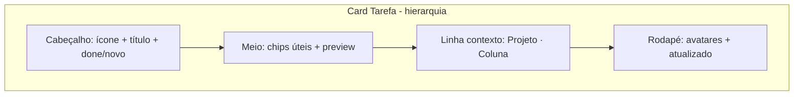

---
name: Simplify carousel cards
overview: "Reduzir poluição visual nos carrosséis da Home: remover organização dos cards, reorganizar metadados de tarefas numa única linha discreta antes do rodapé, e simplificar cards de projeto (sem org, sinais Weave mais compactos, accent mais suave)."
todos:
  - id: simplify-notes-carousel
    content: "notes-carousel: layout limpo; sem border/bg internos; font-normal"
    status: pending
  - id: simplify-projects-carousel
    content: "project-carousel: sem org; sem pills/bg internos; progresso texto; font-normal"
    status: pending
    status: pending
isProject: false
---

# Simplificar design dos carrosséis da Home

## Problema

Após enriquecer os cards, cada item empilha **muitas camadas** (org + projeto/coluna + chips de status + prioridade + preview + tags + rodapé). Na prática quase todos os itens repetem “Weave Software” e o caminho do projeto, o que gera ruído — como na captura que você enviou.

**Decisões confirmadas:**
- Não exibir organização nos cards.
- **Contexto de projeto/coluna:** uma linha só, **logo acima do rodapé** (não no topo do card).
- **Tipografia:** dentro dos cards, **nenhum texto em negrito** (`font-normal` em tudo).
- **Superfícies internas:** nenhum elemento **dentro** do card com `border`, `border-*`, `bg-*` ou `backgroundColor` inline — só texto e ícones com cor. Separadores viram espaçamento (`mt`/`pt`), não `border-t`.
- **Exceção:** a moldura do próprio card (borda externa do container) e, em projetos, opcionalmente `border-l-2` na lateral do card (não é “pill” interna).



---

## 1. Carrossel de Tarefas — [`notes-carousel.tsx`](weave-app/app/(protected)/home/_components/notes-carousel.tsx)

### Remover
- Bloco `organization_name` / logo (linhas ~210–225).
- Bloco intermediário com `FolderKanban` + link `ExternalLink` (~227–258).
- Chip de `status` técnico (ex. `visible`) — não agrega valor no resumo da Home.
- Import/link `ExternalLink` e mapa `projectPublicIdByProjectId` se ficarem sem uso.

### Reorganizar layout do card

| Zona | Conteúdo |
|------|----------|
| **Topo** | `ProjectIcon` (se houver) + título `font-normal` (2 linhas max, sem semibold) + indicadores `done` / `novo` |
| **Meio** | Metadados em **texto plano** separados por `·` ou espaço: prioridade (cor do texto), prazo, subtarefa, até 2 tags (cor do texto, sem caixinha) |
| **Preview** | `line-clamp-2` descrição |
| **Antes do rodapé** | Linha `Projeto · Coluna` — `text-[9px] text-neutral-500`, sem borda superior |
| **Rodapé** | Avatares (sem borda nos círculos, se possível) + “Atualizado” em texto simples |

### Sem bordas/bg internos (tarefas)
Remover de todos os elementos internos:
- Pills de prioridade, prazo, subtarefa, tags (`border`, `bg-*`, `backgroundColor` inline).
- Badge “concluída” com caixa verde → só ícone `CircleCheck` colorido.
- `border-t` do rodapé e da linha de contexto.
- Fundo colorido do card (`style` com `backgroundColor` / `boxShadow` por `properties.color`) — card neutro uniforme.

Indicador “novo”: manter dot sem caixa (já é só bolinha).

Exemplo linha de contexto (sem `border-t`):

```tsx
<p className="mb-1 truncate text-[9px] text-neutral-500">
  {projectName}{stageName ? ` · ${stageName}` : ""}
</p>
```

Posicionar **imediatamente acima** do rodapé, com `mt-auto` ou ordem flex no footer.

### Tipografia (tarefas)
- Título e metadados: `font-normal` em todo o card.

### Ajustes visuais leves
- Reduzir `min-h-[176px]` para `min-h-[148px]`.
- Card com `bg-neutral-50` / dark fixo — sem tint por cor da nota.

**API/contexto:** manter campos `organization_*` em [`notes-context.tsx`](weave-app/app/_contexts/notes-context.tsx) — só não renderizar na Home.

---

## 2. Carrossel de Projetos — [`project-carousel.tsx`](weave-app/app/(protected)/home/_components/project-carousel.tsx)

### Remover
- Bloco `organization_name` / logo (~227–242).

### Simplificar sinais Weave Engine
Hoje há bolinha + badge de ações + badge “Novo” **debaixo do título**.

- Mover para **linha antes do rodapé** (texto/dot apenas, sem pills):
  - **Risco:** dot colorido + `title` i18n.
  - **Novo / ações:** texto `font-normal` colorido, sem `rounded-full` com fundo.

### Cor do projeto (sem bg interno)
- Remover `backgroundColor` / `boxShadow` no wrapper do card.
- Opcional: `border-l-2` na cor do projeto no **container** do card (única borda permitida além da moldura externa).
- Barra de progresso: preferir **só label + `%` em texto**; se manter barra, trilho sem `bg` visível ou remover barra por completo para evitar “caixa” cinza.

### Hierarquia do card (após limpeza)

| Zona | Conteúdo |
|------|----------|
| Topo | Ícone + título `font-normal` + prioridade (ícone) |
| Meta | Metodologia + data em texto simples (`Scrum · Atualizado …`) |
| Meio | Descrição, tags como texto colorido (máx. 2), progresso só `%` ou linha mínima |
| Antes do rodapé | Contadores + Weave em texto/dot, sem pills |
| Rodapé | Status em texto + ícones/contagens numéricas, sem badge com fundo |

### Sem bordas/bg internos (projetos)
- Remover: badge metodologia com `border`/`bg`, status “Aberto” com caixa, pills Weave, tags com caixa, `border-t` entre seções, trilho cinza da barra de progresso (ou a barra inteira).
- Status do projeto: texto + ícone Lucide, cor semântica, **sem** wrapper `border`/`bg`.

Opcional: esconder chip `{n} colunas` quando `stagesCount === 0` (já é o caso).

---

## 3. i18n

Sem chaves novas obrigatórias. Chaves `workspace` / `openProject` podem permanecer no locale para uso futuro; não é necessário apagá-las.

---

## 4. Escopo e testes

- **Só UI** nos dois componentes da Home; sem mudança de API.
- Validar na `/home`:
  - Cards sem linha “Weave Software”.
  - Tarefa com projeto: contexto `Projeto · Coluna` só acima do rodapé.
  - Nenhum chip/caixa colorida dentro dos cards; só tipografia e ícones.
  - Projeto: sem fundo tint no card; Weave discreto em texto/dot.
  - Dark mode e cards vazios (sem projeto) sem espaço morto grande.

---

## Arquivos tocados

| Arquivo | Mudança |
|---------|---------|
| [`notes-carousel.tsx`](weave-app/app/(protected)/home/_components/notes-carousel.tsx) | Org/status/link fora; metadados em texto; contexto no rodapé; zero border/bg interno |
| [`project-carousel.tsx`](weave-app/app/(protected)/home/_components/project-carousel.tsx) | Org fora; metadados em texto; Weave dot/texto; progresso sem trilho; zero border/bg interno |