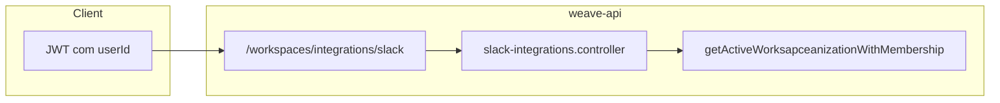

# Worksapceanizar contrato Slack, migration e variáveis

## 1. Contrato da API (org ativa vs `:orgId`)

**Decisão de produto já refletida no código:** os endpoints de integração Slack seguem o mesmo padrão que o resto de [`weave-api/src/modules/workspaces/workspaces.routes.js`](weave-api/src/modules/workspaces/workspaces.routes.js): após `verifyToken`, a organização vem do **contexto ativo** do utilizador (`getActiveWorksapceanizationWithMembership`), não de um `:orgId` na URL.

| Caminho real (v1) | Autenticação | Permissão |
|-------------------|--------------|-----------|
| `GET /api/v1/workspaces/integrations/slack` | Bearer | `MANAGE_GLOBAL_INTEGRATIONS` (checado no controller) |
| `PUT /api/v1/workspaces/integrations/slack/default-channel` | idem | idem |
| `DELETE /api/v1/workspaces/integrations/slack` | idem | idem |
| `GET /api/v1/webhooks/slack/install` | Bearer | idem + redirect OAuth |

**Como organizar a documentação para não divergir do plano antigo:**

- Manter [`weave-api/documents/routes/slack-integration.md`](weave-api/documents/routes/slack-integration.md) como **fonte canónica** da secção “API surface” (já descreve paths sem `:orgId`).
- Em [`weave-api/documents/routes/workspaces-routes.md`](weave-api/documents/routes/workspaces-routes.md), garantir uma linha explícita: *“Slack: escopo = organização ativa do JWT/membership; não usar `workspaceId` no path.”*
- Se no futuro existir **troca de workspace** no front com org explícita, aí sim faria sentido introduzir `/:orgId/...` **ou** header `X-Worksapceanization-Id` validado contra membership — fora do escopo atual.

## 2. Migration SQL (aplicar na base em uso)

O ficheiro já existe: [`weave-api/db_structure_docs/migrations/2026-05-09_create_workspace_slack_integrations.sql`](weave-api/db_structure_docs/migrations/2026-05-09_create_workspace_slack_integrations.sql).

**Processo recomendado (manual, como o resto das migrations do repo):**

1. Identificar a instância PostgreSQL (local Docker, Azure, etc.) e credenciais já usadas por `DATABASE_*` em [`weave-api/.env`](weave-api/.env) ou Doppler.
2. Executar o ficheiro **uma vez** por ambiente (dev/staging/prod), por exemplo:
   - `psql "$DATABASE_URL" -f weave-api/db_structure_docs/migrations/2026-05-09_create_workspace_slack_integrations.sql`
3. Opcional de governança: após estabilizar, espelhar a tabela em [`weave-api/db_structure_docs/new_structure_db.sql`](weave-api/db_structure_docs/new_structure_db.sql) para quem faz bootstrap “from zero” — útil mas não obrigatório para quem só aplica migrations incrementais.

**Não há** hoje um `npm run migrate` no [`weave-api/package.json`](weave-api/package.json); por isso a “organização” é: **documentar o comando no sítio onde já falas de migrations** (ex.: secção existente no [`weave-api/README.md`](weave-api/README.md) que referencia outras migrations em `db_structure_docs/migrations/`).

## 3. Variáveis Slack no ambiente

**Onde o Docker lê:** [`docker-compose.yml`](docker-compose.yml) no `server` usa `env_file` na ordem `./.env` (raiz) e `./weave-api/.env` (opcionais). Convém **não duplicar** chaves conflituosas; escolher um ficheiro “dono” das vars da API em dev local.

Variáveis mínimas (já listadas em [`weave-api/.env.example`](weave-api/.env.example)):

- `SLACK_CLIENT_ID`, `SLACK_CLIENT_SECRET` — OAuth install/callback.
- `SLACK_SIGNING_SECRET` — obrigatório se usares `POST /webhooks/slack/events` ou interactivity.
- `SECRET_KEY` — já existente; usado no JWT do `state` OAuth Slack.
- `FRONTEND_URL` — redirect pós-OAuth para `/app/settings/integrations`.
- Opcionais: `SLACK_REDIRECT_URI`, `SLACK_BOT_SCOPES`.

**Worksapceanização sugerida:**

- **Desenvolvimento local:** copiar de `.env.example` para `weave-api/.env` e preencher; commitar apenas `.env.example`.
- **Produção (compose):** mesmo conjunto no `.env` da raiz ou no secret manager que já usam (`DOPPLER_CONFIG=prd` no compose); garantir que `SLACK_REDIRECT_URI` no Slack App coincide com o host real da API (`https://apis.weavenotes.app/.../callback` ou o que tiveres).

## 4. Checklist operacional (ordem prática)

1. Aplicar migration na base do ambiente.
2. Configurar Slack App (redirect URL + bot scopes alinhados a [`weave-api/src/services/slack/slack.client.js`](weave-api/src/services/slack/slack.client.js)).
3. Preencher env no `server` e reiniciar o container / processo.
4. Fluxo de teste: utilizador com papel admin → `GET .../webhooks/slack/install` → callback → `PUT .../default-channel` → ação que dispara notify (ex. colaborador em nota).

## 5. Trabalho opcional de “higiene” de docs (pequeno)

- Acrescentar linhas `SLACK_*` à tabela “Variáveis de Ambiente” do [`weave-api/README.md`](weave-api/README.md) (hoje a tabela não menciona Slack; o detalhe está em `slack-integration.md` e `.env.example`).
- Isto evita que alguém procure só no README e não encontre o fluxo completo.
