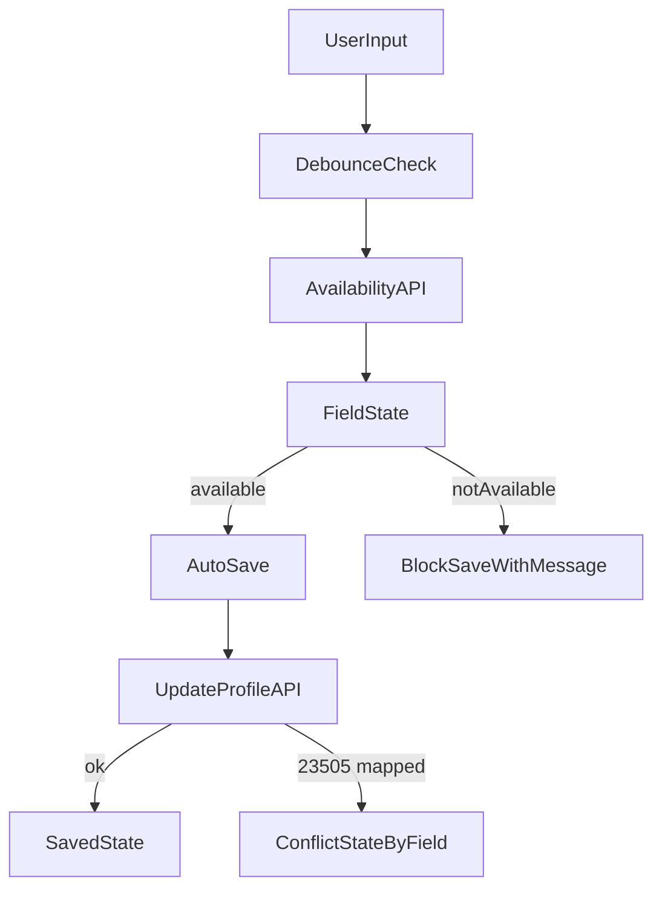

# Plano de unicidade para usuário (backend + checagem em tempo real)

## Objetivo
Garantir que `email`, `username` e `phone_number` sejam validados de forma consistente em todos os fluxos, com:
- checagem preventiva (availability),
- tratamento robusto de corrida de concorrência via erro de banco (`23505`),
- contrato claro para o frontend consumir em tempo real.

## Arquivos principais a alterar
- Backend rotas/controller de usuário: [`/home/gaelgomes/projetos/weave-notes/weave-api/src/modules/users/users.routes.js`](/home/gaelgomes/projetos/weave-notes/weave-api/src/modules/users/users.routes.js)
- Backend update profile: [`/home/gaelgomes/projetos/weave-notes/weave-api/src/modules/users/controllers/user-data.controller.js`](/home/gaelgomes/projetos/weave-notes/weave-api/src/modules/users/controllers/user-data.controller.js)
- Backend create account: [`/home/gaelgomes/projetos/weave-notes/weave-api/src/modules/users/controllers/create-users.controller.js`](/home/gaelgomes/projetos/weave-notes/weave-api/src/modules/users/controllers/create-users.controller.js)
- Repositório de busca de usuário: [`/home/gaelgomes/projetos/weave-notes/weave-api/src/modules/users/repositories/search-users.repository.js`](/home/gaelgomes/projetos/weave-notes/weave-api/src/modules/users/repositories/search-users.repository.js)
- Repositório de update de usuário: [`/home/gaelgomes/projetos/weave-notes/weave-api/src/modules/users/repositories/user-data.repository.js`](/home/gaelgomes/projetos/weave-notes/weave-api/src/modules/users/repositories/user-data.repository.js)
- Frontend endpoints/API: [`/home/gaelgomes/projetos/weave-notes/weave-app/app/_services/api-methods.ts`](/home/gaelgomes/projetos/weave-notes/weave-app/app/_services/api-methods.ts)
- Frontend auth service/context: [`/home/gaelgomes/projetos/weave-notes/weave-app/app/_services/authentication/auth-service.ts`](/home/gaelgomes/projetos/weave-notes/weave-app/app/_services/authentication/auth-service.ts), [`/home/gaelgomes/projetos/weave-notes/weave-app/app/_contexts/auth-context.tsx`](/home/gaelgomes/projetos/weave-notes/weave-app/app/_contexts/auth-context.tsx)
- UI de settings: [`/home/gaelgomes/projetos/weave-notes/weave-app/app/(protected)/settings/page.tsx`](/home/gaelgomes/projetos/weave-notes/weave-app/app/(protected)/settings/page.tsx)

## Estratégia técnica
1. **Criar endpoint de disponibilidade no backend (tempo real)**
- Adicionar rota (ex.: `GET /users/check-availability`) recebendo `email`, `username`, `phone_number` e opcionalmente ignorando o próprio usuário autenticado.
- Responder payload padronizado por campo, por exemplo:
  - `email: { available: boolean, reason?: "already_in_use" }`
  - `username: { available: boolean, reason?: "already_in_use" }`
  - `phone_number: { available: boolean, reason?: "already_in_use" }`
- Implementar busca por campo com query dedicada e normalização mínima (trim/lower no email).

2. **Padronizar validação em todos os fluxos de escrita**
- Em `create-account`, `update-profile` e fluxos relacionados, usar a mesma lógica de disponibilidade para os 3 campos.
- Corrigir lacuna atual de `phone_number` (hoje sem precheck no update).
- Manter respostas com status semântico (`409 Conflict`) e body consistente para frontend.

3. **Adicionar fallback transacional para corrida (DB unique violation)**
- Capturar `error.code === "23505"` nos controllers/repositories de usuário.
- Mapear constraint/coluna violada para erro funcional por campo (`email`, `username`, `phone_number`) em vez de `500` genérico.
- Garantir que mesmo com requisições simultâneas a API devolve erro amigável e determinístico.

4. **Integrar frontend para verificação em tempo real**
- Adicionar novo endpoint em `API_ENDPOINTS` e função de serviço em `auth-service`.
- Na tela de settings, chamar check com debounce nos campos `email`, `username`, `phone_number` (sem bloquear digitação).
- Exibir feedback por campo (disponível/indisponível) e impedir autosave quando o valor estiver indisponível.
- Manter senha fora desse fluxo.

5. **Padronizar contrato de erro para submit/autosave**
- Atualizar `updateUser` no contexto para interpretar payload de conflito por campo e devolver mensagem tratável pela UI.
- Garantir comportamento consistente entre validação prévia (realtime) e validação final (submit/autosave).

## Fluxo desejado (alto nível)

## Critérios de aceite
- `email`, `username` e `phone_number` têm checagem de disponibilidade em tempo real.
- Todos os fluxos de escrita de usuário retornam `409` consistente para conflito de unicidade.
- `23505` não vaza mais como erro genérico de servidor nos cenários de conflito de usuário.
- UI de settings bloqueia autosave de valor indisponível e mostra feedback claro por campo.
- Contrato backend/frontend unificado para conflito por campo (mesma estrutura em precheck e submit).