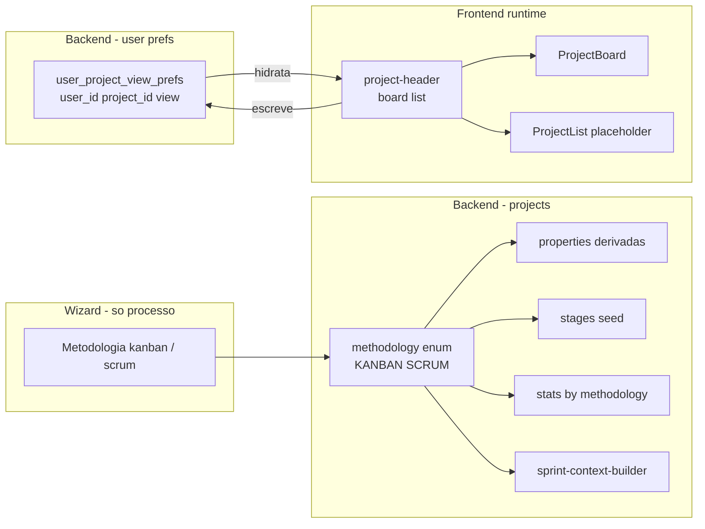

# Separação de view (UI) vs methodology (processo) no módulo `projects`

## Problema atual (resumo do diagnóstico)

`methodology` e `default_view` foram tratados como gêmeos no produto, mas têm domínios diferentes:

- `methodology` é **processo**: dirige seed de stages, properties derivadas (`type`, `wip_limit_enabled`, `sprint_duration_weeks`, `estimation_type`), agregação de stats e contexto da IA em [sprint-context-builder.js](weave-api/src/services/reasoning/sprint-context-builder.js).
- `default_view` é **preferência de UI**: o único uso real é [`projects/[id]/page.tsx:67`](weave-app/app/(protected)/projects/[id]/page.tsx) `setActiveView(projectData.default_view ‖ "board")`. Não influencia regra de negócio nenhuma.

Inconsistências eliminadas pelo plano:

- `project_methodology_enum` aceita `WATERFALL` e `CUSTOM`, mas `METHODOLOGY_CONFIGS` em [normalizer.js:29-102](weave-api/src/modules/projects/normalizer.js) só tem `kanban` e `scrum` → fallback silencioso para kanban.
- `project_view_enum` aceita `CALENDAR | TIMELINE | GANTT`, mas o front renderiza só `board` (linhas 114-128 de [`projects/[id]/page.tsx`](weave-app/app/(protected)/projects/[id]/page.tsx)) e o header só mostra `board | list | timeline`.
- `properties.type` (`continuous_flow | iterative | custom`) duplica a semântica de `methodology` no JSONB e pode divergir.
- Wizard expõe metodologia e view lado a lado em [`BasicStep.tsx:213-281`](weave-app/app/(protected)/projects/new/_components/steps/BasicStep.tsx) com os mesmos ícones — induz a sensação de "mesma decisão".

## Decisões guia

- `default_view` deixa de ser coluna do `projects` e vira **preferência por usuário** numa nova tabela `user_project_view_prefs`.
- `project_methodology_enum` é reduzido a `KANBAN | SCRUM`. Os outros valores voltam quando houver implementação real.
- `project_view_enum` é **dropado** com a coluna; o app valida `board | list` no controller.
- Em prod, projetos com `methodology IN ('WATERFALL','CUSTOM')` são convertidos para `KANBAN` no swap do enum.
- O header reduz para `board | list`; `timeline` placeholder sai (não tem renderização).

## Arquitetura final (alvo)



## Backend — `weave-api/`

### 1. Migration SQL (em `db_structure_docs/migrations/`)

Arquivo único `2026-05-08_split_view_pref_and_shrink_methodology.sql`, em duas etapas idempotentes:

```sql
-- A) Preferencia de view por usuario (substitui projects.default_view)
CREATE TABLE IF NOT EXISTS public.user_project_view_prefs (
  user_id uuid NOT NULL REFERENCES public.users(id) ON DELETE CASCADE,
  project_id uuid NOT NULL REFERENCES public.projects(id) ON DELETE CASCADE,
  view text NOT NULL DEFAULT 'board' CHECK (view IN ('board','list')),
  updated_at timestamptz NOT NULL DEFAULT now(),
  PRIMARY KEY (user_id, project_id)
);
CREATE INDEX IF NOT EXISTS idx_upvp_project ON public.user_project_view_prefs(project_id);

-- Backfill: copia preferencia atual do projeto para o owner
INSERT INTO public.user_project_view_prefs (user_id, project_id, view)
SELECT p.user_id, p.id, LOWER(p.default_view::text)
FROM public.projects p
WHERE LOWER(p.default_view::text) IN ('board','list')
ON CONFLICT DO NOTHING;

-- B) Reduz methodology a KANBAN | SCRUM (com swap de tipo)
UPDATE public.projects
   SET methodology = 'KANBAN'
 WHERE methodology IN ('WATERFALL','CUSTOM');

CREATE TYPE public.project_methodology_enum_v2 AS ENUM ('KANBAN','SCRUM');
ALTER TABLE public.projects
  ALTER COLUMN methodology DROP DEFAULT,
  ALTER COLUMN methodology TYPE public.project_methodology_enum_v2
    USING methodology::text::public.project_methodology_enum_v2,
  ALTER COLUMN methodology SET DEFAULT 'KANBAN';
DROP TYPE public.project_methodology_enum;
ALTER TYPE public.project_methodology_enum_v2 RENAME TO project_methodology_enum;

-- C) Drop default_view (coluna + enum)
ALTER TABLE public.projects DROP COLUMN default_view;
DROP TYPE public.project_view_enum;
```

Atualizar também [new_structure_db.sql](weave-api/db_structure_docs/new_structure_db.sql) (linhas 183-188 e 198-204) para refletir o estado final.

### 2. Novo recurso: preferencia de view por usuario

Criar:
- `weave-api/src/modules/projects/repositories/user-view-prefs.repository.js` com `getUserView(projectId, userId)` e `upsertUserView(projectId, userId, view)`.
- `weave-api/src/modules/projects/controllers/user-view-prefs.controller.js` (extends `ProjectsCoreController`) com `getMyView` e `setMyView`.

Em [`projects.routes.js`](weave-api/src/modules/projects/projects.routes.js) adicionar (depois de `requireProjectPermission(READ_PROJECT_CONTENT)`):

```js
router.get(
  "/:id/my-view-preference",
  verifyToken,
  highTrafficLimiter,
  requireProjectPermission(PROJECT_PERMISSIONS.READ_PROJECT_CONTENT),
  validateGetMyViewPref,
  userViewPrefsController.getMyView.bind(userViewPrefsController)
);
router.put(
  "/:id/my-view-preference",
  verifyToken,
  standardTrafficLimiter,
  requireProjectPermission(PROJECT_PERMISSIONS.READ_PROJECT_CONTENT),
  validateSetMyViewPref,
  userViewPrefsController.setMyView.bind(userViewPrefsController)
);
```

Adicionar `validateGetMyViewPref` e `validateSetMyViewPref` em [`projects.validators.js`](weave-api/src/modules/projects/projects.validators.js) — body aceita `{ view: "board" | "list" }`.

### 3. Remover `default_view` do core de projetos

- [normalizer.js](weave-api/src/modules/projects/normalizer.js): remover `DEFAULT_VIEW`, parametro `default_view` no `projectData`, e as entradas/fallbacks de `waterfall`/`custom` no `METHODOLOGY_CONFIGS` (já eram fantasmas).
- [projects-create.controller.js:32,113](weave-api/src/modules/projects/controllers/projects-create.controller.js): remover `default_view` do destructuring e do payload.
- [projects-create.repository.js:21,31,62,92](weave-api/src/modules/projects/repositories/projects-create.repository.js): remover `default_view` da SQL `INSERT` e dos parametros.
- [projects-core.controller.js:257](weave-api/src/modules/projects/controllers/projects-core.controller.js): retirar `default_view` do `_formatProjectResponse`.
- [projects-read.repository.js](weave-api/src/modules/projects/repositories/projects-read.repository.js): remover `p.default_view` dos `SELECT`s nas linhas 314, 362, 483, 568, 659.

### 4. Reduzir validators e stats de `methodology`

- [`projects.validators.js:66`](weave-api/src/modules/projects/projects.validators.js): `METHODOLOGIES = ["KANBAN", "SCRUM"]`.
- [projects-read.controller.js:473](weave-api/src/modules/projects/controllers/projects-read.controller.js): `VALID_METHODOLOGIES = ["kanban", "scrum"]`.
- [projects-read.controller.js:550-557](weave-api/src/modules/projects/controllers/projects-read.controller.js): retirar `waterfall` e `custom` do payload `methodology`.
- [projects-read.repository.js:1407-1412 e 1526-1531](weave-api/src/modules/projects/repositories/projects-read.repository.js): retirar os `FILTER (WHERE methodology = 'WATERFALL'/'CUSTOM')` do CTE `methodology_stats`.

## Frontend — `weave-app/`

### 5. Schemas e service

- [`projects.schema.ts:118-125`](weave-app/app/_services/projects-service/projects.schema.ts):
  - Remover `default_view` do `ProjectSchema`.
  - `methodology` passa a `z.enum(["scrum","kanban"])` (sem `waterfall`/`custom`).
- [`projects-service.ts`](weave-app/app/_services/projects-service/projects-service.ts):
  - Remover `default_view` de `CreateProjectData` / `UpdateProjectData`.
  - Adicionar `getMyProjectView(projectId): Promise<"board"|"list">` e `setMyProjectView(projectId, view)`.
- [`projects-context.tsx`](weave-app/app/_contexts/projects-context.tsx): expor os dois novos metodos.

### 6. Wizard de criacao

- [`create-project-wizard.types.ts`](weave-app/app/(protected)/projects/new/_components/create-project-wizard.types.ts) e [`CreateProjectWizard.tsx:22-28`](weave-app/app/(protected)/projects/new/_components/CreateProjectWizard.tsx): remover `default_view` de `BasicDraft` e `DEFAULT_BASIC`.
- [`BasicStep.tsx:34-52,248-281`](weave-app/app/(protected)/projects/new/_components/steps/BasicStep.tsx): remover bloco "Visualizacao padrao" inteiro, remover `VIEW_OPTIONS`, deixar a tela de "Basico" focada em titulo, descricao, **metodologia**, cor e icone. O texto "Define as etapas iniciais do quadro" permanece — agora honesto.
- [`BasicStep.tsx:130-141`](weave-app/app/(protected)/projects/new/_components/steps/BasicStep.tsx): retirar `default_view` do payload de `createProject`.
- [`StagesStep.tsx:10-35`](weave-app/app/(protected)/projects/new/_components/steps/StagesStep.tsx): remover entradas `waterfall`/`custom` do `METHODOLOGY_STAGE_DEFAULTS`.

### 7. Tela do projeto e detalhes

- [`projects/[id]/page.tsx:43-67`](weave-app/app/(protected)/projects/[id]/page.tsx): substituir `setActiveView(projectData.default_view ‖ "board")` por chamada a `getMyProjectView(projectId)`. Tipar `activeView` apenas como `"board" | "list"`. Em `setActiveView`, disparar `setMyProjectView(projectId, v)` (best-effort, sem bloqueio).
- [`projects/[id]/details/page.tsx`](weave-app/app/(protected)/projects/[id]/details/page.tsx):
  - Remover `VIEW_OPTIONS`/`VIEW_LABELS` (linhas 34, 52-58).
  - Remover `default_view` de `formData` (linhas 237, 305) e do bloco UI (linhas 731-745).
  - `METHODOLOGY_OPTIONS = ["kanban", "scrum"] as const` (linha 33) e `METHODOLOGY_LABELS` correspondente.
- [`project-header.tsx:59-63`](weave-app/app/(protected)/projects/_components/project-header.tsx): reduzir botoes para `board | list` (remover `timeline`, que nao tem render).

### 8. Documentacao

- Atualizar trecho "Projects — GET list filters" no [README.md](weave-api/README.md) refletindo `methodology` reduzido (sem `waterfall`/`custom`).
- Pequena nota em `weave-app/DESIGN_SYSTEM.md` (se aplicavel) sobre a separacao "view = UI pref por usuario".

## Validacao final

- `GET /api/projects/:id` nao retorna mais `default_view`.
- `GET /api/projects/:id/my-view-preference` retorna `{ view: "board" | "list" }`; `PUT` persiste.
- Criar projeto com `methodology=WATERFALL` ou `CUSTOM` retorna 422 em vez de cair em fallback silencioso.
- Header lista somente views renderizaveis; UI persiste a escolha por usuario.
- Stats e contexto de IA continuam funcionando, agora citando apenas KANBAN/SCRUM.