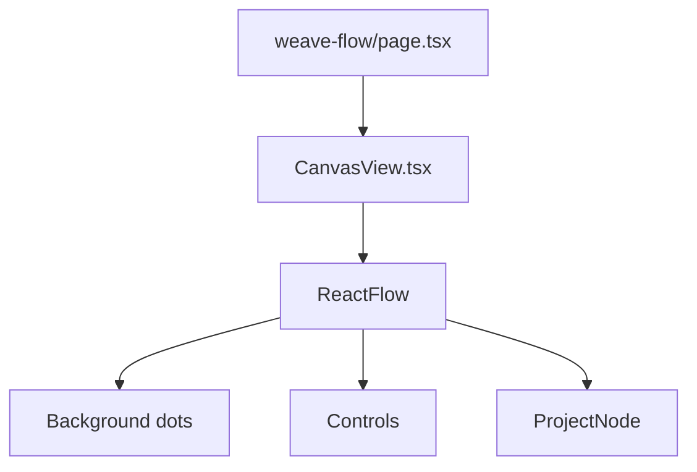

# Weave Flow — Canvas inicial (React Flow)

## Contexto do repositório

- O [`weave-app/package.json`](weave-app/package.json) **não** inclui React Flow; a integração será via **`@xyflow/react`** (React Flow 12+) + **`import '@xyflow/react/dist/style.css'`** (requisito oficial do pacote).
- O shell autenticado em [`weave-app/app/_components/protected-layout.tsx`](weave-app/app/_components/protected-layout.tsx) já encadeia **`flex-1 min-h-0`** até `{children}` — ideal para um canvas que preenche o viewport **sem** `h-64` em cards; a área do React Flow pode ser **`min-h-0 flex-1`** (superfície do grafo, não “card”).
- Navegação principal em [`weave-app/app/(protected)/_components/layout/sidebar.tsx`](weave-app/app/(protected)/_components/layout/sidebar.tsx); chaves de `nav` vivem nos três ficheiros em [`weave-app/app/_i18n/locales/`](weave-app/app/_i18n/locales/) e o tipo `TranslationKeys` é inferido a partir de [`pt-BR.ts`](weave-app/app/_i18n/locales/pt-BR.ts) — qualquer chave nova deve existir em **pt-BR, en-US e es-ES**.

## Decisões técnicas alinhadas ao pedido

| Tema | Abordagem |
|------|-----------|
| Paleta | Apenas utilitários **`neutral-*`** nos componentes novos (texto, fundos, bordas). |
| Alturas | **ProjectNode** e cabeçalhos/editoriais: **sem** `h-*` / `h-full`; espaçamento vertical com **`py-*`**, conteúdo em **`flex flex-col gap-*`**. Área do grafo: **`min-h-0 flex-1`** no wrapper (não é card). |
| Glassmorphism | Ex.: `bg-white/70 dark:bg-neutral-950/55`, `backdrop-blur-md`, `border border-neutral-200/70`, `ring-1 ring-neutral-950/5`. |
| Voice | Empty states / placeholders: terceira pessoa focada no produto (“A Weave…”). |
| Dados do nó | Tipo único **`role`** (string); **`aiStatus: { health; message }`**. Sugestão de `health`: **`'healthy' \| 'at_risk'`** (extensível depois). |
| Risco IA | `healthy`: visual neutro. `at_risk`: **`shadow-lg shadow-orange-500/20`** (ou `shadow-[0_0_24px_-4px_rgba(249,115,22,0.35)]` se precisar de glow mais fino) + bloco de mensagem **só quando há risco**, para o card “crescer” organicamente (sem `max-h-*` arbitrário em número mágico — basta montar/desmontar o bloco ou `grid` com transição suave opcional). |

## Ficheiros a criar

1. **[`weave-app/app/(protected)/weave-flow/_components/ProjectNode.tsx`](weave-app/app/(protected)/weave-flow/_components/ProjectNode.tsx)**  
   - `"use client"`.  
   - `import type { NodeProps } from '@xyflow/react'`.  
   - Exportar tipo **`ProjectNodeData`** (ou ficheiro colado `project-node.types.ts` se preferir separação mínima).  
   - `memo()` + **`nodeTypes` estável** na página pai (ver abaixo).  
   - Estrutura: título, `role` (pill ou label editorial), descrição; secção condicional para **`aiStatus.message`** quando `health === 'at_risk'`.  
   - **Handle(s)** opcionais (`Position` top/bottom) para ligações futuras — não obrigatório para o MVP visual, mas útil para “fluxo de valor”.

2. **[`weave-app/app/(protected)/weave-flow/_components/CanvasView.tsx`](weave-app/app/(protected)/weave-flow/_components/CanvasView.tsx)**  
   - `"use client"`.  
   - Importar estilos **`@xyflow/react/dist/style.css`** aqui **ou** uma vez em [`weave-app/app/(protected)/weave-flow/layout.tsx`](weave-app/app/(protected)/weave-flow/layout.tsx) (layout segmentado evita duplicação se houver mais páginas).  
   - `ReactFlow` com **`nodeTypes`** em `useMemo`: `{ project: ProjectNode }`.  
   - **`Background`** variant **`dots`**, cor **`neutral`**, opacidade baixa (ex. `color` + `gap` adequados; classe Tailwind no wrapper se necessário).  
   - **`Controls`** (zoom/pan nativos).  
   - Estado inicial: `useNodesState` / `useEdgesState` com **dados mock** (2–3 nós, um `at_risk`) posicionados em colunas que sugerem fases (Discovery → Rollout) **só como demonstração** — sem API.  
   - Empty state (lista vazia): mensagem curta em terceira pessoa.  
   - `proOptions={{ hideAttribution: true }}` se a licença MIT do projeto permitir ocultar attribution (ver [docs de proOptions](https://reactflow.dev/api-reference/react-flow#prooptions); caso contrário, omitir).

3. **[`weave-app/app/(protected)/weave-flow/page.tsx`](weave-app/app/(protected)/weave-flow/page.tsx)**  
   - Shell da página: **`flex min-h-0 flex-1 flex-col`**.  
   - Cabeçalho editorial minimalista (**`py-6 px-4 md:px-6`**, borda `border-neutral-200`, tipografia `text-neutral-900` / `text-neutral-500`): título **“Weave Flow”** + subtítulo alinhado ao posicionamento (macro-épicos, não tarefas).  
   - Corpo: `<CanvasView />` dentro de **`min-h-0 flex-1 flex flex-col`**.

4. **Navegação e i18n (recomendado para a feature ser descoberta)**  
   - Nova entrada na sidebar após Projetos: path **`/weave-flow`**, ícone Lucide adequado (ex. **`Waypoints`** ou **`GitBranch`** — evitar reutilizar **`Workflow`** já usado em “Áreas”).  
   - Chave **`nav.weaveFlow`** em [`pt-BR.ts`](weave-app/app/_i18n/locales/pt-BR.ts), [`en-US.ts`](weave-app/app/_i18n/locales/en-US.ts), [`es-ES.ts`](weave-app/app/_i18n/locales/es-ES.ts) com label **“Weave Flow”** (ou tradução curta coerente em EN/ES).

## Dependência

- Executar no **`weave-app/`**: `npm install @xyflow/react` (pin compatível com React 19 conforme lockfile após install).

## Diagrama de composição (alto nível)

## Riscos / notas

- **Tema escuro:** manter tokens `neutral` e overlays semitransparentes testados em `dark:` como no resto do app (`#1d1d1b` aparece no layout — alinhar fundo do canvas a **`bg-neutral-100 dark:bg-[#1d1d1b]`** ou `neutral-950` para consistência).  
- **`nodeTypes`:** referência estável (`useMemo`) para evitar re-renders infinitos do React Flow.
