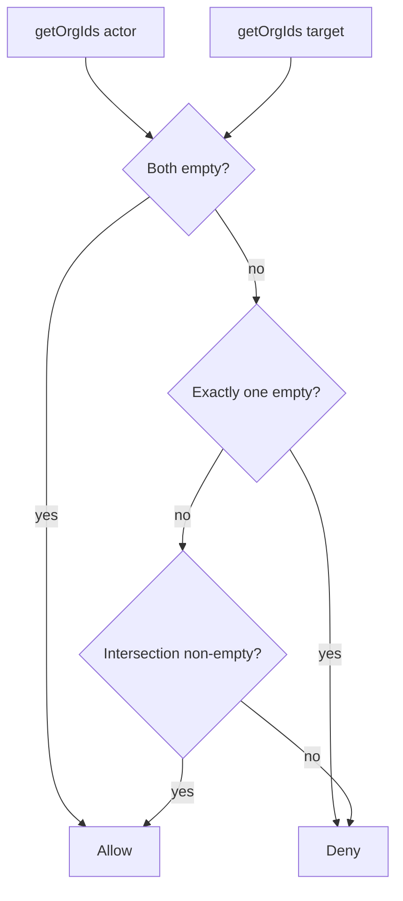

# Isolamento de busca e partilha por workspace

## Regra de negócio (única fonte de verdade)

- Considerar **membria ativa de workspace** como qualquer linha em `organization_members` com `deleted = false`, `status = 'ACTIVE'`, `suspended = false`, e obter o conjunto **`organization_id` distintos** para o utilizador (inclui linhas com `area_id` preenchido ou `NULL`, para não tratar incorretamente quem só tem área).
- **`usersMayInteract(actorUserId, targetUserId)`** (assíncrono):
  - `orgA` = conjunto de orgs do actor; `orgB` = do target.
  - Se **ambos** os conjuntos são vazios → **permitido** (dois utilizadores “pessoais”, fora de workspace).
  - Se **exatamente um** é vazio → **negado** (utilizador de fora não descobre/partilha com utilizador de workspace, e o contrário).
  - Se **ambos** não vazios → **permitido** sse `orgA ∩ orgB` não é vazio (qualquer organização em comum).

Isto cobre os dois requisitos: (1) dentro do workspace só pessoas da(s) mesma(s) org(s); (2) membros de workspace não são alvo de quem está totalmente fora.

## 1. Camada reutilizável (backend)

Criar um módulo pequeno com JSDoc, por exemplo:

- [`weave-api/src/modules/users/repositories/workspace-user-scope.repository.js`](weave-api/src/modules/users/repositories/workspace-user-scope.repository.js) **ou** [`weave-api/src/services/users/workspace-user-scope.js`](weave-api/src/services/users/workspace-user-scope.js)

Funções:

- `getActiveOrganizationIdsForUser(userId)` → `Promise<string[]>` (query única, `SELECT DISTINCT organization_id ...`).
- `usersMayInteract(actorUserId, targetUserId)` → `Promise<boolean>` (duas queries ou uma query com join, conforme preferência de legibilidade).

Não expor PII; só UUIDs e lógica booleana.

## 2. Busca `GET /users/search`

Ficheiros:

- [`weave-api/src/modules/users/repositories/search-users.repository.js`](weave-api/src/modules/users/repositories/search-users.repository.js) — estender `searchUsers(searchTerm, searcherUserId)`:
  - Obter `orgIds` do solicitante (ou integrar numa única query com CTE).
  - Filtrar `users` candidatos para que apenas apareçam utilizadores para os quais `usersMayInteract(searcher, candidate)` seria verdadeiro (equivalente SQL com `EXISTS` / `NOT EXISTS` alinhado à regra acima).
  - Manter filtros atuais: `deleted = false`, `private_profile = false`, `LIKE`, limite 15, ordenação.
- [`weave-api/src/modules/users/controllers/search-users.controllers.js`](weave-api/src/modules/users/controllers/search-users.controllers.js) — passar `userId` do JWT para o repositório.

## 3. Partilha / colaboradores (validação server-side)

Chamar `usersMayInteract(req.user.userId, collaboratorId)` **antes** de adicionar colaborador; em falta responder **403** com mensagem clara (ex.: utilizador não pertence ao mesmo workspace ou cruzamento pessoal/workspace não permitido).

Pontos a alterar:

| Fluxo | Ficheiro |
|--------|----------|
| Notas — adicionar colaborador | [`weave-api/src/modules/notes/controllers/notes-collaborators.controller.js`](weave-api/src/modules/notes/controllers/notes-collaborators.controller.js) |
| Projetos — POST colaborador | [`weave-api/src/modules/projects/controllers/projects-collaborators-create.controller.js`](weave-api/src/modules/projects/controllers/projects-collaborators-create.controller.js) |
| Projetos — PUT colaboradores `action: 'add'` | [`weave-api/src/modules/projects/controllers/projects-update.controller.js`](weave-api/src/modules/projects/controllers/projects-update.controller.js) (ramo `add`) |
| Weave AI — `create_note` com `collaboratorIds` | [`weave-api/src/modules/weave-ai/controllers/chat.controller.js`](weave-api/src/modules/weave-ai/controllers/chat.controller.js) (loop antes de `addCollaborator`) |

Convém extrair um helper único (ex. `assertUsersMayInteractOr403(actorId, targetId, res)`) no módulo de scope ou num `utils` mínimo para evitar duplicação e mensagens inconsistentes.

## 4. Fora de âmbito (comportamento intencional)

- **Convites de organização por e-mail** em [`members.controller.js`](weave-api/src/modules/organizations/controllers/members.controller.js) continuam a ser fluxo de entrada no workspace; não são “busca global” de utilizadores.
- **`findByUsernameOrEmail`** / registo / OAuth: não alterar salvo se no futuro houver requisito explícito.

## 5. Front-end

- Nenhuma alteração obrigatória se a UI só usar `GET /users/search` e IDs devolvidos pelo servidor; o contrato JSON pode manter-se. Opcional: tratar **403** na partilha com toast já existente.

## Diagrama da regra

