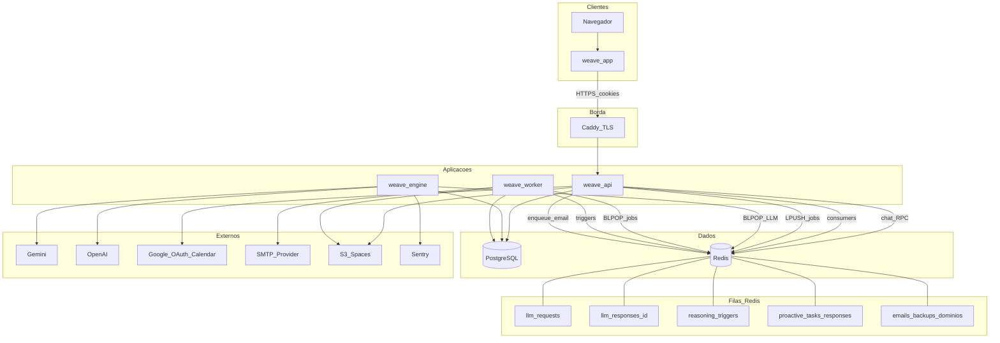
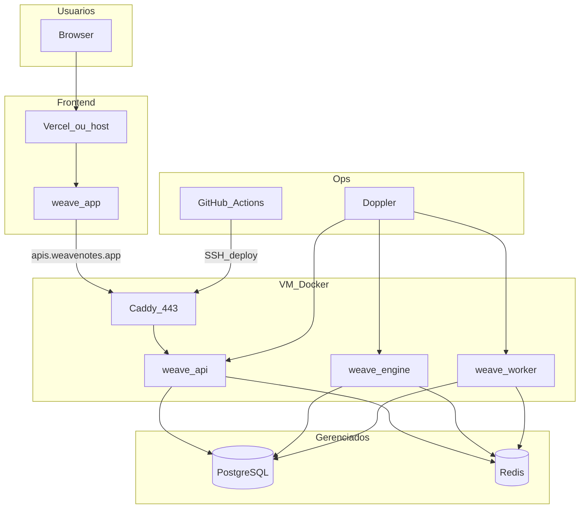

# Arquitetura

## Sistema

```mermaid
flowchart TB
  subgraph clientes [Clientes]
    Browser[Navegador]
    Next[weave_app]
  end
  subgraph borda [Borda]
    Caddy[Caddy_TLS]
  end
  subgraph apps [Aplicacoes]
    API[weave_api]
    Engine[weave_engine]
    Worker[weave_worker]
  end
  subgraph dados [Dados]
    PG[(PostgreSQL)]
    Redis[(Redis)]
  end
  subgraph filas [Filas_Redis]
    F1[llm_requests]
    F2[llm_responses_id]
    F3[reasoning_triggers]
    F4[proactive_tasks_responses]
    F5[emails_backups_dominios]
  end
  subgraph externos [Externos]
    Gemini[Gemini]
    OpenAI[OpenAI]
    Google[Google_OAuth_Calendar]
    SMTP[SMTP_Provider]
    S3[S3_Spaces]
    Sentry[Sentry]
  end
  Browser --> Next
  Next -->|HTTPS_cookies| Caddy
  Caddy --> API
  API --> PG
  API -->|chat_RPC| Redis
  API -->|consumers| Redis
  API -->|LPUSH_jobs| Redis
  Engine -->|BLPOP_LLM| Redis
  Engine --> PG
  Worker -->|BLPOP_jobs| Redis
  Worker -->|triggers| Redis
  Worker --> PG
  Redis --- F1
  Redis --- F2
  Redis --- F3
  Redis --- F4
  Redis --- F5
  Engine --> Gemini
  Engine --> OpenAI
  API --> Google
  API -->|enqueue_email| Redis
  API --> S3
  Worker --> SMTP
  Worker --> S3
  Engine --> Sentry
```

## Infra

```mermaid
flowchart TB
  subgraph users [Usuarios]
    U[Browser]
  end
  subgraph fe [Frontend]
    Host[Vercel_ou_host]
    Build[weave_app]
  end
  subgraph vm [VM_Docker]
    CaddyVM[Caddy_443]
    SvcAPI[weave_api]
    SvcEng[weave_engine]
    SvcWrk[weave_worker]
  end
  subgraph managed [Gerenciados]
    PG2[(PostgreSQL)]
    Redis2[(Redis)]
  end
  subgraph ops [Ops]
    Doppler[Doppler]
    GHA[GitHub_Actions]
  end
  U --> Host
  Host --> Build
  Build -->|apis.weavenotes.app| CaddyVM
  CaddyVM --> SvcAPI
  SvcAPI --> PG2
  SvcAPI --> Redis2
  SvcEng --> Redis2
  SvcWrk --> Redis2
  SvcEng --> PG2
  SvcWrk --> PG2
  GHA -->|SSH_deploy| CaddyVM
  Doppler --> SvcAPI
  Doppler --> SvcEng
  Doppler --> SvcWrk
```
