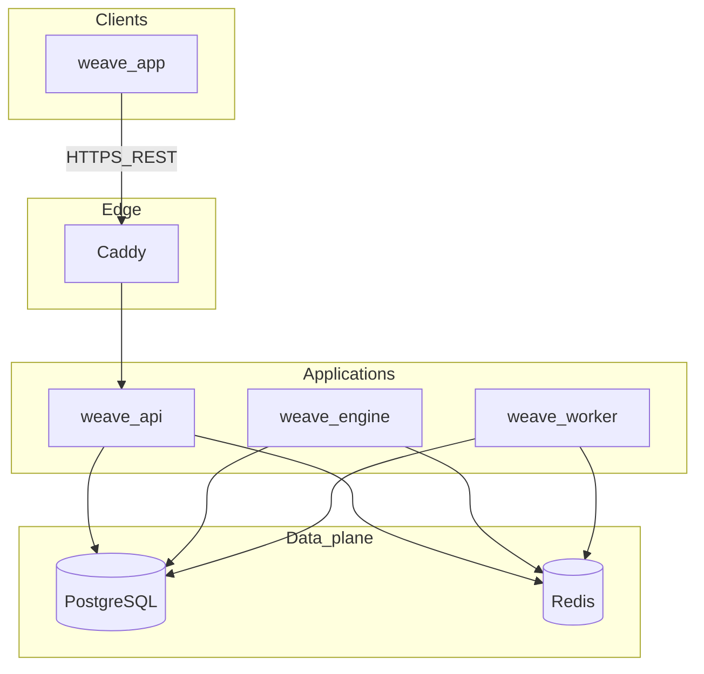

# Weave Notes

Weave Notes is a multi-tenant SaaS for structured work: **organizations**, **projects**, **notes** (block-based content), **collaboration**, **Google Calendar** integration, **Weave AI** (chat, agents, embeddings, scheduled reports), **notifications**, **data export / backups**, **plan limits and usage**, **custom domains** (verification pipeline), and **API tokens**. The system is split into a Next.js client (`weave-app`), an HTTP API (`weave-api`), an AI worker service (`weave-engine`), and a background worker (`weave-worker`). **PostgreSQL** holds authoritative state; **Redis** backs queues and cross-service coordination. Production HTTP is typically fronted by **Caddy** (TLS).

**Production:** [https://weavenotes.app](https://weavenotes.app/)

For deeper front-end or API-only notes, see [weave-app/README.md](weave-app/README.md) and [weave-api/README.md](weave-api/README.md).

---

## Architecture

The browser talks to **weave-api** over HTTPS (often via **Caddy**). The API validates auth, applies tenancy and RBAC, reads/writes **PostgreSQL**, and **pushes jobs to Redis** (plan usage, embeddings, email, backups, domain checks, AI triggers, and LLM requests). **weave-engine** consumes LLM and proactive reasoning queues, calls **Google Generative AI**, and uses PostgreSQL where wired. **weave-worker** runs long-running queue processors and interval-based jobs (plan cycles, due-date reminders). The API also runs **in-process Redis consumers** so proactive AI can be assembled in the API (context build), sent to the engine, and responses persisted (see `weave-api/src/services/reasoning/`).



**Repository layout**

```text
weave-notes/
├── weave-app/          # Next.js (App Router) client
├── weave-api/          # Express REST API + in-process queue consumers
├── weave-worker/       # Background jobs and queue processors
├── weave-engine/       # LLM and proactive reasoning processors
├── compose.server.yml  # Production compose: Caddy + API
├── compose.worker.yml  # Production compose: worker only
├── compose.engine.yml    # Production compose: engine only
├── docker-compose.yml    # Integrated stack: Caddy, server, worker, engine (no DB images)
└── Caddyfile
```

The root `docker-compose.yml` builds **caddy**, **server**, **worker**, and **engine** only. **PostgreSQL and Redis are not defined here**; they are expected via configuration (managed services or a compose override you maintain locally). **`weave-app` is not a service in this file**; run the front end separately during development (`npm run dev` in `weave-app`).

---

## Stack

### Front end (`weave-app`)

| Layer | Technology |
| --- | --- |
| Framework | Next.js 16 (App Router), React 19 |
| Language | TypeScript 5.9 |
| Styling | Tailwind CSS 4, `tailwind-merge`, `class-variance-authority`, `clsx` |
| Editor / content | TipTap 3, Lowlight, Markdown (`react-markdown`, `@uiw/react-md-editor`, remark/rehype) |
| UX | `@dnd-kit/*`, `@floating-ui/dom`, `tippy.js`, `sonner`, `next-themes`, `lucide-react` |
| Validation | Zod 4 |
| Auth client | `jwt-decode` |
| Analytics | `@vercel/analytics` |
| Tooling | ESLint 9, Prettier 3, `eslint-config-next` |

### API (`weave-api`)

| Layer | Technology |
| --- | --- |
| Runtime | Node.js (see CI: Node 20) |
| HTTP | Express 4 |
| Data | `pg`, Redis `ioredis` |
| Auth | `jsonwebtoken`, `express-jwt`, `express-session`, `passport` + Google/GitHub OAuth, `bcrypt`, `cookie-parser` |
| Security / HTTP | `helmet`, `cors`, `express-rate-limit`, `express-validator` |
| Files / media | `multer`, `sharp` |
| Integrations | `googleapis`, `google-auth-library`, `@google/generative-ai`, `resend`, `@aws-sdk/client-s3`, `@aws-sdk/s3-request-presigner` |
| Documents | `pdfkit`, `js-yaml` |
| Build / quality | Babel (`src` → `dist`), TypeScript (`tsc`), ESLint, Prettier |

### Engine (`weave-engine`)

| Layer | Technology |
| --- | --- |
| Runtime | Node.js |
| Data | `pg`, `ioredis` |
| LLM | `@google/generative-ai` |
| HTTP client | `axios` |
| Observability | `@sentry/node`, `@sentry/profiling-node` |

### Worker (`weave-worker`)

| Layer | Technology |
| --- | --- |
| Runtime | Node.js |
| Data | `pg`, `ioredis` |
| Email | `resend` |
| Storage / PDF | `@aws-sdk/client-s3`, `pdfkit` |

### Infrastructure and operations

| Concern | Technology |
| --- | --- |
| TLS / reverse proxy | Caddy 2 |
| Containers | Docker Compose |
| Secrets (optional) | Doppler CLI (`doppler.yaml` per service, `DOPPLER_TOKEN` in Docker entrypoints) |
| Deploy | GitHub Actions over SSH (see `.github/workflows/deploy-*.yml`) |

---

## Business rules

Rules below reflect **current code**, not a marketing feature list. Adjust this section when policies change.

### Tenancy and identity

- Authenticated requests carry user identity (for example `req.user.userId` after JWT/session middleware).
- Many org-scoped routes require an **active organization membership**. Middleware such as [`weave-api/src/middlewares/auth/require-org-permission.js`](weave-api/src/middlewares/auth/require-org-permission.js) loads the active org, checks a required **atomic permission**, and sets `req.organizationContext` on success.
- All mutations must stay within the user’s **organization and project** boundaries enforced in repositories and controllers (defense in depth: never trust IDs from the client without membership checks).

### Organization roles and permissions

Source: [`weave-api/src/modules/organizations/organization-role-policy.js`](weave-api/src/modules/organizations/organization-role-policy.js).

**Roles:** `SUPER_ADMIN`, `ADMIN`, `BILLING_MANAGER`, `MEMBER`, `GUEST`.

**Atomic permissions (`ORG_PERMISSIONS`):** `access_all_org_projects`, `view_member_directory`, `manage_members`, `manage_areas`, `manage_billing_plans`, `manage_global_integrations`, `manage_brand`, `manage_domains`, `manage_org_lifecycle`, `manage_projects`, `manage_tags`, `manage_task_priorities`, `manage_weave_ai`.

**Effective grants:**

| Role | Permissions |
| --- | --- |
| `SUPER_ADMIN` | All `ORG_PERMISSIONS` |
| `ADMIN` | All listed above **except** `manage_billing_plans` |
| `BILLING_MANAGER` | `manage_billing_plans` only |
| `MEMBER` | `view_member_directory`, `manage_projects`, `manage_tags`, `manage_task_priorities` |
| `GUEST` | **None** (empty set in code) |

### Project roles and permissions

Source: [`weave-api/src/modules/projects/project-role-policy.js`](weave-api/src/modules/projects/project-role-policy.js).

**Canonical roles:** `PROJECT_MANAGER`, `CONTRIBUTOR`, `COMMENTER`, `VIEWER`.

**Atomic permissions (`PROJECT_PERMISSIONS`):** `read_project_content`, `comment_project_content`, `write_project_content`, `manage_project_members`, `manage_project_lifecycle`.

**Effective grants:**

| Role | Permissions |
| --- | --- |
| `PROJECT_MANAGER` | All `PROJECT_PERMISSIONS` |
| `CONTRIBUTOR` | read, comment, write |
| `COMMENTER` | read, comment |
| `VIEWER` | read |

**Legacy aliases** still normalize to canonical roles (for example `admin` → `PROJECT_MANAGER`, `member` → `CONTRIBUTOR`) so older membership rows remain valid.

### Plans and usage

Source: [`weave-api/src/modules/plans/plans.controller.js`](weave-api/src/modules/plans/plans.controller.js), [`weave-api/src/modules/plans/plans.repository.js`](weave-api/src/modules/plans/plans.repository.js).

- **Usage rows are created lazily** on first need (`managePlanUsage`); if the user has no assignable plan, initialization fails.
- **Limit checks** compare current nested usage fields to plan limits; `null` / `undefined` limit means **unlimited** for that metric.
- **Consumption** (notes, projects, AI messages, tokens, etc.) is mostly **enqueued** to the worker (`enqueuePlanUsageJob`) so the API stays responsive; **monthly rollover** is owned by the worker (`plans-cycle.processor.js`).
- **Plan limit overrides** can exist per `(plan_id, subscriber_type, subscriber_id)` with active windows (`plan_limit_overrides` in repository).
- **Subscriptions** in data can be scoped to **user** or **organization** (`subscriber_type` in SQL paths in `plans.repository.js`).

### AI and asynchronous processing

- **Interactive chat:** the API validates scope, plans, and context, then coordinates with **Redis queues** and the **engine** for model execution (see `weave-api/src/modules/weave-ai/controllers/chat.controller.js` and engine `chat.processor`).
- **Note embeddings:** can be enqueued from chat flows (`enqueueNoteEmbeddingJob`) for retrieval-style features.
- **Proactive / project reasoning:** worker (or other producers) can push triggers to a **reasoning trigger queue**; the API’s **trigger consumer** builds markdown context and forwards work to the engine’s proactive queue; the **response consumer** persists results and follow-up actions (see `weave-api/src/services/reasoning/trigger-consumer.js`, `response-consumer.js`).

### Worker responsibilities

Processors started from [`weave-worker/src/jobs/index.js`](weave-worker/src/jobs/index.js):

| Area | Responsibility |
| --- | --- |
| **Email** | Consume transactional email jobs (Resend); exits if `RESEND_API_KEY` is unset. |
| **Backup export** | Generate user/org backup artifacts and related storage workflow. |
| **Domain verification** | Process custom-domain verification with delayed retries. |
| **Plan usage** | Apply queued usage increments/decrements from the API. |
| **Plan cycle** | Periodic subscription / usage period maintenance. |
| **Due-date reminders** | Daily-style reminders when `DUE_DATE_REMINDER_ENABLED` is not `false` (`DUE_DATE_REMINDER_HOUR_UTC` supported in broader docs). |
| **Embeddings** | Background embedding jobs for notes. |
| **AI report scheduler / delivery** | Schedule and deliver AI report payloads. |
| **Cleanup** | Registered job type for maintenance (for example expired backup download tokens and storage). |

---

## HTTP API surface (modules)

Route modules under `weave-api/src/modules/` (each with `*.routes.js`): **authentication**, **users**, **organizations**, **projects**, **notes**, **tags**, **task_priorities**, **calendar-events**, **notifications**, **backup**, **api-tokens**, **weave-ai**, **plans**, **password**, **webhooks**, plus [`weave-api/src/routes/public.routes.js`](weave-api/src/routes/public.routes.js) and [`weave-api/src/routes/internal.routes.js`](weave-api/src/routes/internal.routes.js).

---

## Local development

### Prerequisites

- Docker and Docker Compose v2 (for the integrated backend stack).
- Node.js **20+** (matches API CI; recommended for local `npm` runs).

### Docker Compose (integrated backend)

From the repository root:

```bash
docker compose up --build
```

Services: **`caddy`**, **`server`** (weave-api), **`worker`**, **`engine`**. Ensure PostgreSQL and Redis are reachable using the connection settings in your `weave-api/.env`, `weave-worker/.env`, and `weave-engine/.env` (and optional repo-root `.env`).

You can start a subset:

```bash
docker compose up server --build
docker compose up worker --build
docker compose up engine --build
```

Optional: add a **`docker-compose.override.yml`** next to `docker-compose.yml` to inject development-only env vars or attach local database containers (Compose merges overrides automatically).

### Without Docker (four terminals)

```bash
# API
cd weave-api && npm install && npm run dev

# Front end
cd weave-app && npm install && npm run dev

# Worker
cd weave-worker && npm install && npm run dev

# Engine
cd weave-engine && npm install && npm run dev
```

### Useful commands

| Package | Commands |
| --- | --- |
| `weave-api` | `npm run dev`, `npm run build`, `npm start`, `npm run check`, `npm test` |
| `weave-app` | `npm run dev`, `npm run build`, `npm start`, `npm run lint`, `npm run format` |
| `weave-worker` | `npm run dev`, `npm start`, `npm run lint`, `npm run format` |
| `weave-engine` | `npm run dev`, `npm start`, `npm run lint`, `npm run format`, `npm run check` |

---

## Environment variables

Each service uses its own `.env` (and optionally a repo-root `.env` consumed by Compose `env_file`):

- `weave-api/.env`
- `weave-worker/.env`
- `weave-engine/.env`
- `weave-app/.env` (for `NEXT_PUBLIC_*` and client build)

Examples referenced across dev configuration include: `NODE_ENV`, `WORKER_BASE_URL`, `WORKER_REQUEST_ORIGIN`, `WORKER_INTERNAL_TOKEN`, `SERVER_BASE_URL`, `WORKER_ALLOWED_ORIGINS`, `FRONTEND_URL`, `DUE_DATE_REMINDER_ENABLED`, `DUE_DATE_REMINDER_HOUR_UTC`, plus database, Redis, OAuth, storage, and AI keys as required by each module.

### Doppler (optional)

Each service can ship with `doppler.yaml`. When `DOPPLER_TOKEN` is set, Docker entrypoints can run the process under `doppler run` so secrets are injected at runtime.

1. In Doppler, create projects aligned with `doppler.yaml` (for example `weave-api`, `weave-worker`, `weave-engine`, `weave-app`) and configs such as `dev` / `prd`.
2. Local CLI: `doppler login`, then `doppler setup` per package; use `npm run dev:doppler` / `npm run build:doppler` / `npm run start:doppler` where defined.
3. Production: use a Doppler **service token** in the same `.env` files Compose loads; compose files set `DOPPLER_CONFIG=prd` where applicable.
4. Without Doppler, omit `DOPPLER_TOKEN` and rely on plain `.env` files.

---

## Deploy

GitHub Actions deploy on push to **`main`** (path-filtered per service):

- [`.github/workflows/deploy-server.yml`](.github/workflows/deploy-server.yml) — validates `weave-api`, SSH deploy, `docker compose -f compose.server.yml up -d --build`
- [`.github/workflows/deploy-worker.yml`](.github/workflows/deploy-worker.yml) — validates `weave-worker`, SSH deploy, `docker compose -f compose.worker.yml up -d --build`
- [`.github/workflows/deploy-engine.yml`](.github/workflows/deploy-engine.yml) — validates `weave-engine` (`npm run check`), SSH deploy, `docker compose -f compose.engine.yml up -d --build`

**Production compose files**

| File | Stack |
| --- | --- |
| `compose.server.yml` | Caddy + `weave-api` |
| `compose.worker.yml` | `weave-worker` |
| `compose.engine.yml` | `weave-engine` |

---

## Troubleshooting

**Port in use**

```bash
docker compose down
```

Check host processes on ports **80**, **443**, and your API port (default **8080** in `weave-api`).

**Changes not visible**

```bash
docker compose up --build
```

If volumes mask updates:

```bash
docker compose down -v
docker compose up --build
```

**Logs**

```bash
docker compose logs -f server
docker compose logs -f worker
docker compose logs -f engine
docker compose logs -f caddy
```

---

## License

MIT. See [LICENSE](LICENSE).
