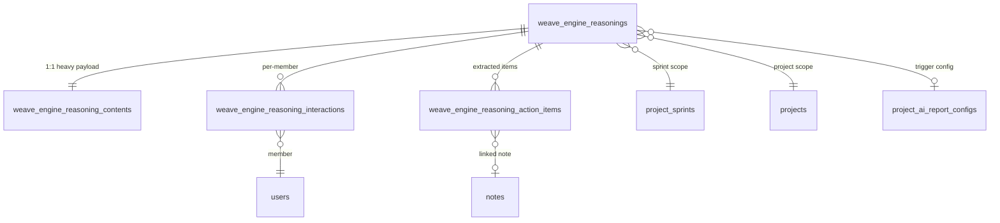

# Tabela para Raciocínios do Weave-Engine (IA Proativa)

## Contexto

O `weave-engine` é o serviço de IA proativa do Weave. O processador proativo gera raciocínios no contexto de **sprints** de projetos. Os tipos de raciocínio estão alinhados com os report types de `project_ai_report_configs`.

---

## Análise de Escalabilidade

### Problema: tabela monolítica

Se colocarmos tudo em uma tabela, temos 3 gargalos:

| Problema                         | Causa                                                                                                               | Impacto                                                                                                         |
| -------------------------------- | ------------------------------------------------------------------------------------------------------------------- | --------------------------------------------------------------------------------------------------------------- |
| **Tabela pesada**                | `output_markdown` (TEXT grande) + `input_context` (JSONB enorme com snapshot de notes, blocks, stages) na mesma row | Scans de listagem lentos — query de "listar últimos 10 raciocínios" carrega payloads enormes desnecessariamente |
| **Interações por membro**        | `is_dismissed`, `is_pinned` são por reasoning, mas cada membro do projeto deve poder dismiss/pin independentemente  | Impossível rastrear quem leu, descartou ou fixou                                                                |
| **Action items não-rastreáveis** | Recomendações da IA ficam enterradas no markdown                                                                    | Impossível marcar como "feito", atribuir a alguém, ou medir adoption rate                                       |

### Solução: 4 tabelas



---

## Tabela 1: `weave_engine_reasonings` (metadata lean)

Tabela principal — só metadados e referências. **Nenhum campo de conteúdo pesado**.

| Coluna               | Tipo                                         | Descrição                                      |
| -------------------- | -------------------------------------------- | ---------------------------------------------- |
| `id`                 | `uuid PK DEFAULT gen_random_uuid()`          | Identificador único                            |
| `project_id`         | `uuid NOT NULL`                              | Projeto que gerou o raciocínio                 |
| `sprint_id`          | `uuid NOT NULL`                              | Sprint associada                               |
| `report_config_id`   | `uuid NULL`                                  | Config de AI report que disparou               |
| `workspace_id`    | `uuid NULL`                                  | Workspaceanização (para escopo)                      |
| `triggered_by`       | `uuid NOT NULL`                              | Usuário/owner que disparou                     |
| `reasoning_type`     | `weave_engine_reasoning_type NOT NULL`       | Tipo do raciocínio (enum)                      |
| `title`              | `varchar(255) NOT NULL`                      | Título (ex: "Sprint 3 - Daily Standup")        |
| `provider_used`      | `varchar(50) NULL`                           | Provider LLM                                   |
| `model_used`         | `varchar(100) NULL`                          | Modelo LLM                                     |
| `safety_label`       | `varchar(20) NOT NULL DEFAULT 'safe'`        | `safe`, `review`, `unsafe`                     |
| `safety_reason`      | `text NULL`                                  | Razão do safety check                          |
| `safety_blocked`     | `bool NOT NULL DEFAULT false`                | Se foi bloqueado                               |
| `status`             | `varchar(20) NOT NULL DEFAULT 'completed'`   | `pending`, `processing`, `completed`, `failed` |
| `error_message`      | `text NULL`                                  | Erro (se falhou)                               |
| `processing_time_ms` | `int NULL`                                   | Tempo de processamento                         |
| `recipient_scope`    | `varchar(20) NOT NULL DEFAULT 'all_members'` | `owner_only`, `all_members`, `custom`          |
| `custom_recipients`  | `jsonb NOT NULL DEFAULT '[]'`                | User IDs específicos                           |
| `action_items_count` | `smallint NOT NULL DEFAULT 0`                | Contagem de action items extraídos             |
| `deleted`            | `bool NOT NULL DEFAULT false`                | Soft delete                                    |
| `deleted_at`         | `timestamptz NULL`                           |                                                |
| `expires_at`         | `timestamptz NULL`                           | Expira no `end_date` da sprint                 |
| `created_at`         | `timestamptz NOT NULL DEFAULT now()`         |                                                |
| `updated_at`         | `timestamptz NOT NULL DEFAULT now()`         |                                                |

---

## Tabela 2: `weave_engine_reasoning_contents` (1:1 heavy payload)

Separada para manter a tabela principal leve. Carregada apenas quando o usuário abre o raciocínio.

| Coluna                 | Tipo                                 | Descrição                                             |
| ---------------------- | ------------------------------------ | ----------------------------------------------------- |
| `id`                   | `uuid PK DEFAULT gen_random_uuid()`  | Identificador                                         |
| `reasoning_id`         | `uuid NOT NULL UNIQUE`               | FK → `weave_engine_reasonings.id`                     |
| `output_markdown`      | `text NOT NULL`                      | Markdown altamente estruturado                        |
| `output_raw`           | `jsonb NULL`                         | Resposta bruta do provider                            |
| `output_metadata`      | `jsonb NOT NULL DEFAULT '{}'`        | Métricas, insights extraídos                          |
| `input_context`        | `jsonb NOT NULL DEFAULT '{}'`        | Snapshot do contexto (notes, blocks, stages, members) |
| `input_prompt`         | `text NULL`                          | Prompt enviado ao LLM                                 |
| `input_system_message` | `text NULL`                          | System message usado                                  |
| `created_at`           | `timestamptz NOT NULL DEFAULT now()` |                                                       |

---

## Tabela 3: `weave_engine_reasoning_interactions` (per-member)

Cada membro do projeto interage independentemente com cada raciocínio.

| Coluna         | Tipo                                 | Descrição                           |
| -------------- | ------------------------------------ | ----------------------------------- |
| `id`           | `uuid PK DEFAULT gen_random_uuid()`  | Identificador                       |
| `reasoning_id` | `uuid NOT NULL`                      | FK → `weave_engine_reasonings.id`   |
| `user_id`      | `uuid NOT NULL`                      | Membro que interagiu                |
| `is_read`      | `bool NOT NULL DEFAULT false`        | Se leu                              |
| `read_at`      | `timestamptz NULL`                   | Quando leu                          |
| `is_dismissed` | `bool NOT NULL DEFAULT false`        | Se descartou                        |
| `dismissed_at` | `timestamptz NULL`                   | Quando descartou                    |
| `is_pinned`    | `bool NOT NULL DEFAULT false`        | Se fixou                            |
| `pinned_at`    | `timestamptz NULL`                   | Quando fixou                        |
| `feedback`     | `varchar(20) NULL`                   | `helpful`, `not_helpful`, `neutral` |
| `feedback_at`  | `timestamptz NULL`                   | Quando deu feedback                 |
| `created_at`   | `timestamptz NOT NULL DEFAULT now()` |                                     |
| `updated_at`   | `timestamptz NOT NULL DEFAULT now()` |                                     |

**Constraint única**: `UNIQUE (reasoning_id, user_id)` — um registro por membro por reasoning.

---

## Tabela 4: `weave_engine_reasoning_action_items` (items rastreáveis)

Action items extraídos do output da IA. Podem ser atribuídos e acompanhados.

| Coluna         | Tipo                                 | Descrição                           |
| -------------- | ------------------------------------ | ----------------------------------- |
| `id`           | `uuid PK DEFAULT gen_random_uuid()`  | Identificador                       |
| `reasoning_id` | `uuid NOT NULL`                      | FK → `weave_engine_reasonings.id`   |
| `note_id`      | `uuid NULL`                          | Nota referenciada (se aplicável)    |
| `position`     | `smallint NOT NULL DEFAULT 0`        | Ordem no raciocínio                 |
| `content`      | `text NOT NULL`                      | Texto do action item                |
| `priority`     | `varchar(20) NULL`                   | `critical`, `high`, `medium`, `low` |
| `assigned_to`  | `uuid NULL`                          | Membro atribuído                    |
| `is_completed` | `bool NOT NULL DEFAULT false`        | Se foi resolvido                    |
| `completed_at` | `timestamptz NULL`                   | Quando foi resolvido                |
| `completed_by` | `uuid NULL`                          | Quem resolveu                       |
| `deleted`      | `bool NOT NULL DEFAULT false`        | Soft delete                         |
| `deleted_at`   | `timestamptz NULL`                   |                                     |
| `created_at`   | `timestamptz NOT NULL DEFAULT now()` |                                     |
| `updated_at`   | `timestamptz NOT NULL DEFAULT now()` |                                     |

---

## Enum

```sql
CREATE TYPE public.weave_engine_reasoning_type AS ENUM (
  'sprint_kickoff',
  'daily_standup',
  'sprint_review',
  'deadline_alert',
  'analysis'
);
```

---

## Indexes (todas as tabelas)

### `weave_engine_reasonings`

```sql
-- Listagem principal: raciocínios de um projeto+sprint
CREATE INDEX idx_reasonings_project_sprint
  ON public.weave_engine_reasonings(project_id, sprint_id, created_at DESC)
  WHERE deleted = false;

-- Filtrar por tipo dentro do projeto
CREATE INDEX idx_reasonings_project_type
  ON public.weave_engine_reasonings(project_id, reasoning_type)
  WHERE deleted = false;

-- Worker: raciocínios pendentes
CREATE INDEX idx_reasonings_status_pending
  ON public.weave_engine_reasonings(status, created_at)
  WHERE deleted = false AND status IN ('pending', 'processing');

-- Por organização
CREATE INDEX idx_reasonings_workspace
  ON public.weave_engine_reasonings(workspace_id, created_at DESC)
  WHERE deleted = false AND workspace_id IS NOT NULL;

-- Job de limpeza por expiração
CREATE INDEX idx_reasonings_expires_at
  ON public.weave_engine_reasonings(expires_at)
  WHERE deleted = false AND expires_at IS NOT NULL;

-- Auditoria de segurança
CREATE INDEX idx_reasonings_safety
  ON public.weave_engine_reasonings(safety_label)
  WHERE deleted = false AND safety_label != 'safe';
```

### `weave_engine_reasoning_contents`

```sql
-- Lookup 1:1 rápido
CREATE UNIQUE INDEX idx_reasoning_contents_reasoning_id
  ON public.weave_engine_reasoning_contents(reasoning_id);
```

### `weave_engine_reasoning_interactions`

```sql
-- Garantir unicidade membro+reasoning
CREATE UNIQUE INDEX uq_reasoning_interaction_user
  ON public.weave_engine_reasoning_interactions(reasoning_id, user_id);

-- Não lidos de um membro (para badge/notification)
CREATE INDEX idx_reasoning_interactions_unread
  ON public.weave_engine_reasoning_interactions(user_id, is_read)
  WHERE is_read = false;

-- Feedback para analytics
CREATE INDEX idx_reasoning_interactions_feedback
  ON public.weave_engine_reasoning_interactions(reasoning_id, feedback)
  WHERE feedback IS NOT NULL;
```

### `weave_engine_reasoning_action_items`

```sql
-- Action items de um raciocínio
CREATE INDEX idx_reasoning_actions_reasoning
  ON public.weave_engine_reasoning_action_items(reasoning_id, position)
  WHERE deleted = false;

-- Action items pendentes de um membro
CREATE INDEX idx_reasoning_actions_assigned
  ON public.weave_engine_reasoning_action_items(assigned_to, is_completed)
  WHERE deleted = false AND assigned_to IS NOT NULL;

-- Action items por nota
CREATE INDEX idx_reasoning_actions_note
  ON public.weave_engine_reasoning_action_items(note_id)
  WHERE deleted = false AND note_id IS NOT NULL;
```

---

## Triggers

```sql
-- reasonings
CREATE TRIGGER trg_weave_engine_reasonings_set_updated_at
BEFORE UPDATE ON public.weave_engine_reasonings
FOR EACH ROW EXECUTE FUNCTION public.set_row_updated_at();

CREATE TRIGGER trg_weave_engine_reasonings_set_deleted_at
BEFORE UPDATE ON public.weave_engine_reasonings
FOR EACH ROW EXECUTE FUNCTION public.set_row_deleted_at();

-- interactions
CREATE TRIGGER trg_reasoning_interactions_set_updated_at
BEFORE UPDATE ON public.weave_engine_reasoning_interactions
FOR EACH ROW EXECUTE FUNCTION public.set_row_updated_at();

-- action_items
CREATE TRIGGER trg_reasoning_action_items_set_updated_at
BEFORE UPDATE ON public.weave_engine_reasoning_action_items
FOR EACH ROW EXECUTE FUNCTION public.set_row_updated_at();

CREATE TRIGGER trg_reasoning_action_items_set_deleted_at
BEFORE UPDATE ON public.weave_engine_reasoning_action_items
FOR EACH ROW EXECUTE FUNCTION public.set_row_deleted_at();
```

---

## Query de Acesso via Project Members

```sql
-- Listar raciocínios visíveis para um membro (listagem lean, sem conteúdo)
SELECT
  r.id, r.reasoning_type, r.title, r.status, r.safety_label,
  r.action_items_count, r.created_at,
  ri.is_read, ri.is_pinned, ri.is_dismissed
FROM weave_engine_reasonings r
INNER JOIN project_members pm
  ON pm.project_id = r.project_id
  AND pm.user_id = $1
  AND pm.deleted = false
  AND pm.suspended = false
LEFT JOIN weave_engine_reasoning_interactions ri
  ON ri.reasoning_id = r.id
  AND ri.user_id = $1
WHERE r.project_id = $2
  AND r.sprint_id = $3
  AND r.deleted = false
  AND r.safety_blocked = false
  AND (
    r.recipient_scope = 'all_members'
    OR (r.recipient_scope = 'owner_only' AND r.triggered_by = $1)
    OR (r.recipient_scope = 'custom' AND r.custom_recipients @> to_jsonb($1::text))
  )
ORDER BY r.created_at DESC;

-- Abrir um raciocínio (carregar conteúdo pesado)
SELECT rc.*
FROM weave_engine_reasoning_contents rc
WHERE rc.reasoning_id = $1;
```

---

## Output Markdown Estruturado

O campo `output_markdown` em `reasoning_contents` deve conter markdown altamente estruturado. Exemplo para `daily_standup`:

```markdown
# 📋 Daily Standup — Sprint 3 (04/05/2026)

## ✅ Completed Yesterday

- **[NOTE-123] Implement login flow** — moved to Done by @gael
- **[NOTE-456] Fix navbar alignment** — completed

## 🔄 In Progress

- **[NOTE-789] Calendar integration** — 60% complete, blocked by API auth
  - ⚠️ _Deadline: 06/05/2026 (2 days remaining)_

## 🚨 Blockers & Risks

- API authentication token expiring — needs renewal by team lead
- Sprint velocity below target (18/30 points completed)

## 📊 Sprint Metrics

| Metric           | Value        |
| ---------------- | ------------ |
| Days Remaining   | 5            |
| Points Completed | 18/30        |
| Velocity Trend   | ↘️ Declining |
| Tasks At Risk    | 2            |

## 💡 AI Recommendations

1. Prioritize **[NOTE-789]** blocker resolution
2. Consider moving **[NOTE-901]** to next sprint
3. Schedule sync meeting for API auth issue
```

---

## Proposed Changes

### Database Schema

#### [NEW] `db_structure_docs/migrations/2026-05-04_create_weave_engine_reasonings.sql`

Migration standalone com:

1. Enum `weave_engine_reasoning_type`
2. Tabela `weave_engine_reasonings`
3. Tabela `weave_engine_reasoning_contents`
4. Tabela `weave_engine_reasoning_interactions`
5. Tabela `weave_engine_reasoning_action_items`
6. Todas as FKs, indexes e triggers

#### [MODIFY] [new_structure_db.sql](file:///home/gaelgomes/projetos/weave-notes/weave-api/db_structure_docs/new_structure_db.sql)

Adicionar ao arquivo principal:

1. DROPs na seção de reset
2. DROP do enum
3. As 4 tabelas + enum
4. FKs, indexes e triggers nas seções correspondentes

---

## Verification Plan

### Manual Verification

- Revisão do SQL contra os padrões do `new_structure_db.sql`
- Validação das FKs com `project_sprints`, `project_ai_report_configs`, `project_members`
- Verificação dos índices para os patterns de query via roles
